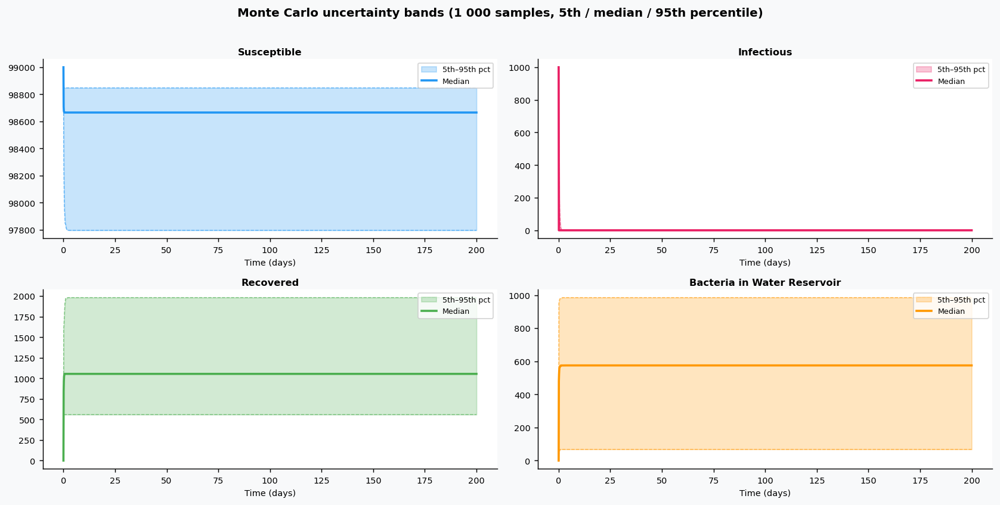
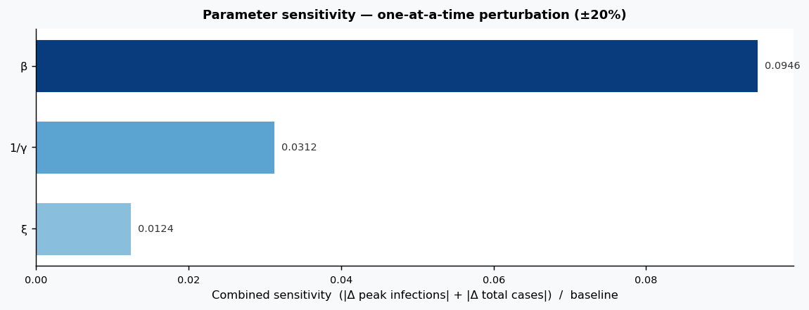

# Phase 4 — Uncertainty quantification: Cholera1

This report summarizes parameter distributions (general framework), Monte Carlo simulation, and sensitivity analysis.

## Source model provenance

| Field | Value |
|-------|-------|
| Phase 3 fill mode | retrieval_only |
| Phase 3 run dir | `cholera1_gemini_phase3` |

---

## 1. Parameter distributions (Task 9.1)

Distributions are assigned using the **general framework** (typed parameter uncertainty): same distribution families and typical ranges for similar parameter types across diseases.

| Parameter | Type | Family | Low | High | Point | Note |
|-----------|------|--------|-----|------|-------|------|
| β | transmission | lognormal | 1 | 5 | 3 |  |
| 1/γ | recovery | lognormal | 2.9 | 14 | 8.45 |  |
| 1/δ | mortality | lognormal | 3 | 41 | 22 |  |
| ξ | other | uniform | 0.01 | 10 | 5.005 |  |
| κ | transmission | lognormal | 5 | 10 | 7.5 |  |

## 2. Monte Carlo simulation (Task 9.2)

- **Samples:** 1000   **Days:** 200   **Compartments:** Susceptible, Infectious, Recovered, Bacteria in Water Reservoir

**Peak value spread (5th / 50th / 95th percentile across ensemble):**

| Compartment | P5 peak | P50 peak | P95 peak |
|-------------|---------|----------|----------|
| Susceptible | 99000.00 | 99000.00 | 99000.00 |
| Infectious | 1000.00 | 1000.00 | 1000.00 |
| Recovered | 559.07 | 1054.00 | 1981.47 |
| Bacteria in Water Reservoir | 67.88 | 575.27 | 985.39 |

## 3. Sensitivity analysis (Task 9.3)

**Parameter ranking by combined impact on peak infections + total cases:**

| Rank | Parameter | Peak impact | Total cases impact | Combined |
|------|-----------|------------|-------------------|---------|
| 1 | β | 0.0000 | 0.0946 | 0.0946 |
| 2 | 1/γ | 0.0000 | -0.0312 | 0.0312 |
| 3 | ξ | 0.0000 | -0.0124 | 0.0124 |
| 4 | 1/δ | 0.0000 | 0.0000 | 0.0000 |
| 5 | κ | 0.0000 | 0.0000 | 0.0000 |

---
*Generated by Phase 4 (uncertainty quantification). Model: `cholera1`. General framework: `phase 4/data/general_framework.json`.*