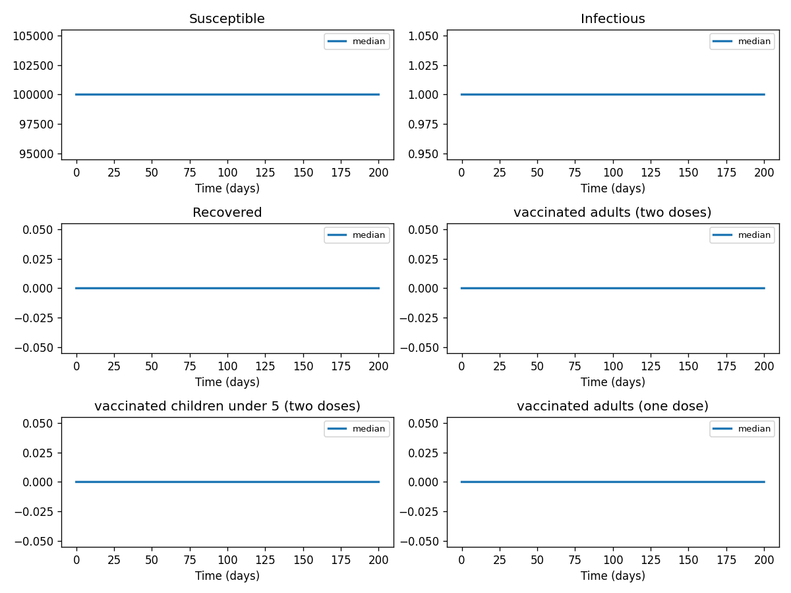
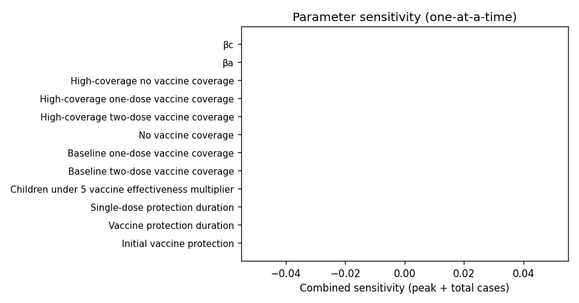

# Phase 4 — Uncertainty quantification: Cholera2

This report summarizes parameter distributions (general framework), Monte Carlo simulation, and sensitivity analysis.

## Source model provenance

| Field | Value |
|-------|-------|
| Phase 3 fill mode | retrieval_only |
| Phase 3 run dir | `cholera2_gemini_phase3` |

---

## 1. Parameter distributions (Task 9.1)

Distributions are assigned using the **general framework** (typed parameter uncertainty): same distribution families and typical ranges for similar parameter types across diseases.

| Parameter | Type | Family | Low | High | Point |
|-----------|------|--------|-----|------|-------|
| Initial vaccine protection | other | uniform | 38.0 | 114.0 | 76.0 |
| Vaccine protection duration | recovery | lognormal | 35.92522605134023 | 94.31354138942821 | 60.0 |
| Single-dose protection duration | recovery | lognormal | 0.5987537675223377 | 1.5718923564904717 | 1.0 |
| Children under 5 vaccine effectiveness multiplier | mortality | lognormal | 20.464904826414195 | 92.65694286512978 | 46.9 |
| Baseline two-dose vaccine coverage | other | uniform | 35.0 | 105.0 | 70.0 |
| Baseline one-dose vaccine coverage | other | uniform | 5.0 | 15.0 | 10.0 |
| No vaccine coverage | other | uniform | 10.0 | 30.0 | 20.0 |
| High-coverage two-dose vaccine coverage | other | uniform | 47.5 | 142.5 | 95.0 |
| High-coverage one-dose vaccine coverage | other | uniform | 0.835 | 2.505 | 1.67 |
| High-coverage no vaccine coverage | other | uniform | 1.665 | 4.995 | 3.33 |
| βa | transmission | lognormal | 0.1885693725108722 | 0.5959892616943278 | 0.35 |
| βc | transmission | lognormal | 0.1885693725108722 | 0.5959892616943278 | 0.35 |
| βa_2dose | transmission | lognormal | 0.5387696357453492 | 1.702826461983794 | 1.0 |
| βc_2dose | transmission | lognormal | 0.5387696357453492 | 1.702826461983794 | 1.0 |
| βa_1dose | transmission | lognormal | 0.5387696357453492 | 1.702826461983794 | 1.0 |
| βc_1dose | transmission | lognormal | 0.5387696357453492 | 1.702826461983794 | 1.0 |
| σ*k | progression | lognormal | 0.07542774900434891 | 0.23839570467773116 | 0.14 |
| (1-σ)*k | progression | lognormal | 0.11314162350652335 | 0.3575935570165967 | 0.21 |
| γ | recovery | lognormal | 0.07085652084859344 | 0.18601774146708241 | 0.11834 |
| ν2 | other | uniform | 0.0075 | 0.0225 | 0.015 |
| ν1 | other | uniform | 0.001 | 0.003 | 0.002 |
| ω2 | other | uniform | 0.001925 | 0.005775000000000001 | 0.00385 |
| ω1 | other | uniform | 0.009615 | 0.028845000000000003 | 0.01923 |
| ωr | mortality | lognormal | 0.004363519152753564 | 0.019756277796402946 | 0.01 |
| ξs | other | uniform | 0.4 | 1.2000000000000002 | 0.8 |
| … | … | … | … | … | … (*34 total*) |

## 2. Monte Carlo simulation (Task 9.2)

- **Samples:** 1000   **Days:** 200   **Compartments:** Susceptible, Infectious, Recovered, vaccinated adults (two doses), vaccinated children under 5 (two doses), vaccinated adults (one dose), vaccinated children under 5 (one dose), exposed / recently infected, environmental vibrio cholerae reservoir

**Peak value spread (5th / 50th / 95th percentile across ensemble):**

| Compartment | P5 peak | P50 peak | P95 peak |
|-------------|---------|----------|----------|
| Susceptible | — | — | — |
| Infectious | — | — | — |
| Recovered | — | — | — |
| vaccinated adults (two doses) | — | — | — |
| vaccinated children under 5 (two doses) | — | — | — |
| vaccinated adults (one dose) | — | — | — |
| vaccinated children under 5 (one dose) | — | — | — |
| exposed / recently infected | — | — | — |
| environmental vibrio cholerae reservoir | — | — | — |

## 3. Sensitivity analysis (Task 9.3)

**Parameter ranking by combined impact on peak infections + total cases:**

| Rank | Parameter | Peak impact | Total cases impact | Combined |
|------|-----------|------------|-------------------|---------|
| 1 | Initial vaccine protection | 0.0000 | 0.0000 | 0.0000 |
| 2 | Vaccine protection duration | 0.0000 | 0.0000 | 0.0000 |
| 3 | Single-dose protection duration | 0.0000 | 0.0000 | 0.0000 |
| 4 | Children under 5 vaccine effectiveness multiplier | 0.0000 | 0.0000 | 0.0000 |
| 5 | Baseline two-dose vaccine coverage | 0.0000 | 0.0000 | 0.0000 |
| 6 | Baseline one-dose vaccine coverage | 0.0000 | 0.0000 | 0.0000 |
| 7 | No vaccine coverage | 0.0000 | 0.0000 | 0.0000 |
| 8 | High-coverage two-dose vaccine coverage | 0.0000 | 0.0000 | 0.0000 |
| 9 | High-coverage one-dose vaccine coverage | 0.0000 | 0.0000 | 0.0000 |
| 10 | High-coverage no vaccine coverage | 0.0000 | 0.0000 | 0.0000 |

---
*Generated by Phase 4 (uncertainty quantification). Model: `cholera2`. General framework: `phase 4/data/general_framework.json`.*