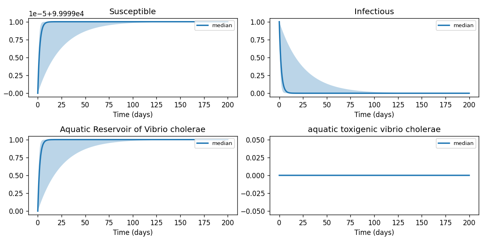

# Phase 4 — Uncertainty quantification: Cholera3

This report summarizes parameter distributions (general framework), Monte Carlo simulation, and sensitivity analysis.

## Source model provenance

| Field | Value |
|-------|-------|
| Phase 3 fill mode | rag_only |
| Phase 3 run dir | `cholera3_gemini_phase3` |

---

## 1. Parameter distributions (Task 9.1)

Distributions are assigned using the **general framework** (typed parameter uncertainty): same distribution families and typical ranges for similar parameter types across diseases.

| Parameter | Type | Family | Low | High | Point |
|-----------|------|--------|-----|------|-------|
| H | other | uniform | 0.0 | 1.0 | 0.5 |
| n | mortality | lognormal | 1e-05 | 0.01 | 0.005005 |
| a | transmission | lognormal | 0.01 | 1.0 | 0.505 |
| K | other | uniform | 25.0 | 75.0 | 50.0 |
| r | recovery | lognormal | 0.05 | 0.5 | 0.275 |
| nb | other | uniform | 0.0 | 1.0 | 0.5 |
| mb | other | uniform | 0.0 | 1.0 | 0.5 |
| e | other | uniform | 0.0 | 1.0 | 0.5 |

## 2. Monte Carlo simulation (Task 9.2)

- **Samples:** 1000   **Days:** 200   **Compartments:** Susceptible, Infectious, Aquatic Reservoir of Vibrio cholerae, aquatic toxigenic vibrio cholerae

**Peak value spread (5th / 50th / 95th percentile across ensemble):**

| Compartment | P5 peak | P50 peak | P95 peak |
|-------------|---------|----------|----------|
| Susceptible | — | — | — |
| Infectious | — | — | — |
| Aquatic Reservoir of Vibrio cholerae | — | — | — |
| aquatic toxigenic vibrio cholerae | — | — | — |

## 3. Sensitivity analysis (Task 9.3)

**Parameter ranking by combined impact on peak infections + total cases:**

| Rank | Parameter | Peak impact | Total cases impact | Combined |
|------|-----------|------------|-------------------|---------|
| 1 | H | 0.0000 | 0.0000 | 0.0000 |
| 2 | n | 0.0000 | 0.0000 | 0.0000 |
| 3 | a | 0.0000 | 0.0000 | 0.0000 |
| 4 | K | 0.0000 | 0.0000 | 0.0000 |
| 5 | r | 0.0000 | 0.0000 | 0.0000 |
| 6 | nb | 0.0000 | 0.0000 | 0.0000 |
| 7 | mb | 0.0000 | 0.0000 | 0.0000 |
| 8 | e | 0.0000 | 0.0000 | 0.0000 |

---
*Generated by Phase 4 (uncertainty quantification). Model: `cholera3`. General framework: `phase 4/data/general_framework.json`.*