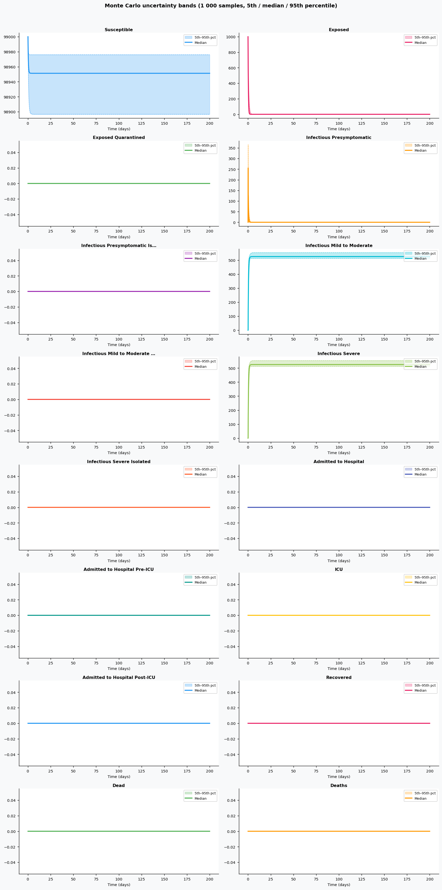
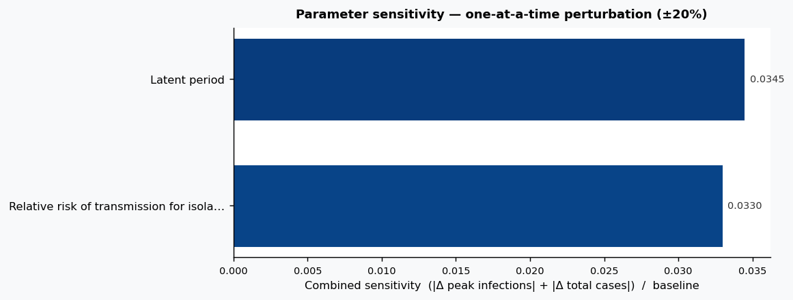

# Phase 4 — Uncertainty quantification: Covid1

This report summarizes parameter distributions (general framework), Monte Carlo simulation, and sensitivity analysis.

## Source model provenance

| Field | Value |
|-------|-------|
| Phase 3 fill mode | both |
| Phase 3 run dir | `covid1_gemini_phase3` |

---

## 1. Parameter distributions (Task 9.1)

Distributions are assigned using the **general framework** (typed parameter uncertainty): same distribution families and typical ranges for similar parameter types across diseases.

| Parameter | Type | Family | Low | High | Point | Note |
|-----------|------|--------|-----|------|-------|------|
| Latent period | other | uniform | 1.25 | 3.75 | 2.5 |  |
| Presymptomatic infectious period | recovery | lognormal | 0.5988 | 1.572 | 1 |  |
| Infectious period mild to moderate | other | uniform | 3 | 9 | 6 |  |
| Infectious period severe | other | uniform | 3 | 9 | 6 |  |
| R0 | other | uniform | 1.15 | 3.45 | 2.3 |  |
| Quarantine duration | recovery | lognormal | 8.383 | 22.01 | 14 |  |
| Relative risk of transmission for isolated cases | transmission | lognormal | 0.05388 | 0.1703 | 0.1 |  |
| Hospital length of stay non-ICU | other | uniform | 5 | 15 | 10 |  |
| Hospital length of stay pre-ICU | other | uniform | 1.5 | 4.5 | 3 |  |
| ICU length of stay | other | uniform | 10.5 | 31.5 | 21 |  |
| Hospital length of stay post-ICU | other | uniform | 10.5 | 31.5 | 21 |  |
| Probability of severe infection, <15 yr, no comorbidities | other | uniform | 0.005 | 0.015 | 0.01 |  |
| Probability of severe infection, 15-49 yr, no comorbidities | other | uniform | 0.015 | 0.045 | 0.03 |  |
| Probability of severe infection, 50-69 yr, no comorbidities | other | uniform | 0.06 | 0.18 | 0.12 |  |
| Probability of severe infection, >=70 yr, no comorbidities | other | uniform | 0.175 | 0.525 | 0.35 |  |
| Probability of severe infection, <15 yr, comorbidities | other | uniform | 0.01 | 0.03 | 0.02 |  |
| Probability of severe infection, 15-49 yr, comorbidities | other | uniform | 0.03 | 0.09 | 0.06 |  |
| Probability of severe infection, 50-69 yr, comorbidities | other | uniform | 0.125 | 0.375 | 0.25 |  |
| Probability of severe infection, >=70 yr, comorbidities | other | uniform | 0.38 | 1.14 | 0.76 |  |
| Probability severe case requires ICU | other | uniform | 0.13 | 0.39 | 0.26 |  |
| Probability of death in ICU, <15 yr, no comorbidities | mortality | lognormal | 1e-05 | 0.02 | 0.01001 | † |
| Probability of death in ICU, 15-49 yr, no comorbidities | mortality | lognormal | 0.08727 | 0.3951 | 0.2 |  |
| Probability of death in ICU, 50-69 yr, no comorbidities | mortality | lognormal | 0.1571 | 0.7112 | 0.36 |  |
| Probability of death in ICU, >=70 yr, no comorbidities | mortality | lognormal | 0.2531 | 1.146 | 0.58 |  |
| Probability of death in ICU, <15 yr, comorbidities | mortality | lognormal | 1e-05 | 0.02 | 0.01001 | † |
| … | … | … | … | … | … | (*36 total*) |

† Range inferred from parameter type — no value recovered from paper text.

## 2. Monte Carlo simulation (Task 9.2)

- **Samples:** 1000   **Days:** 200   **Compartments:** Susceptible, Exposed, Exposed Quarantined, Infectious Presymptomatic, Infectious Presymptomatic Isolated, Infectious Mild to Moderate, Infectious Mild to Moderate Isolated, Infectious Severe, Infectious Severe Isolated, Admitted to Hospital, Admitted to Hospital Pre-ICU, ICU, Admitted to Hospital Post-ICU, Recovered, Dead, Deaths

**Peak value spread (5th / 50th / 95th percentile across ensemble):**

| Compartment | P5 peak | P50 peak | P95 peak |
|-------------|---------|----------|----------|
| Susceptible | 99000.00 | 99000.00 | 99000.00 |
| Exposed | 1000.00 | 1000.00 | 1000.00 |
| Exposed Quarantined | 0.00 | 0.00 | 0.00 |
| Infectious Presymptomatic | 140.21 | 255.27 | 365.46 |
| Infectious Presymptomatic Isolated | 0.00 | 0.00 | 0.00 |
| Infectious Mild to Moderate | 512.39 | 525.21 | 553.32 |
| Infectious Mild to Moderate Isolated | 0.00 | 0.00 | 0.00 |
| Infectious Severe | 512.39 | 525.21 | 553.32 |
| Infectious Severe Isolated | 0.00 | 0.00 | 0.00 |
| Admitted to Hospital | 0.00 | 0.00 | 0.00 |

## 3. Sensitivity analysis (Task 9.3)

**Parameter ranking by combined impact on peak infections + total cases:**

| Rank | Parameter | Peak impact | Total cases impact | Combined |
|------|-----------|------------|-------------------|---------|
| 1 | Latent period | -0.0172 | -0.0172 | 0.0345 |
| 2 | Relative risk of transmission for isolated cases | 0.0165 | 0.0165 | 0.0330 |
| 3 | Infectious period mild to moderate | 0.0000 | 0.0000 | 0.0000 |
| 4 | Presymptomatic infectious period | 0.0000 | 0.0000 | 0.0000 |
| 5 | Infectious period severe | 0.0000 | 0.0000 | 0.0000 |
| 6 | R0 | 0.0000 | 0.0000 | 0.0000 |
| 7 | Quarantine duration | 0.0000 | 0.0000 | 0.0000 |
| 8 | Hospital length of stay non-ICU | 0.0000 | 0.0000 | 0.0000 |
| 9 | Hospital length of stay pre-ICU | 0.0000 | 0.0000 | 0.0000 |
| 10 | ICU length of stay | 0.0000 | 0.0000 | 0.0000 |

---
*Generated by Phase 4 (uncertainty quantification). Model: `covid1`. General framework: `phase 4/data/general_framework.json`.*