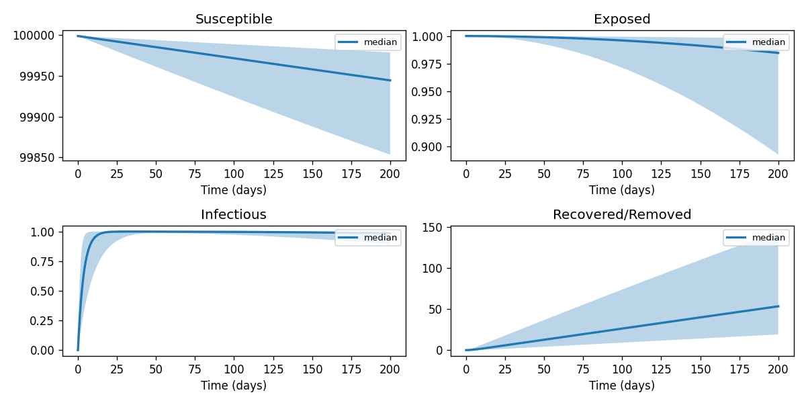
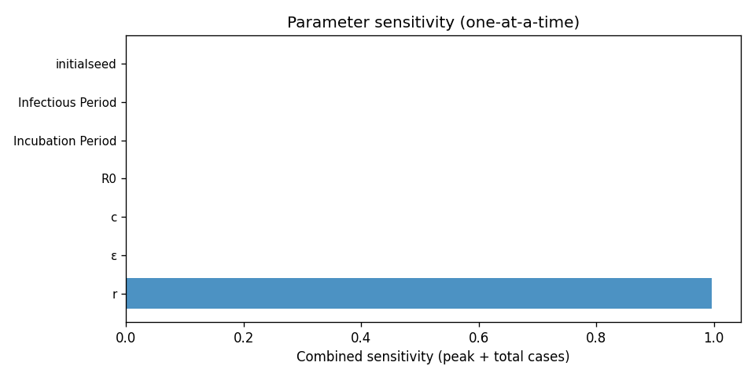

# Phase 4 — Uncertainty quantification: Covid2

This report summarizes parameter distributions (general framework), Monte Carlo simulation, and sensitivity analysis.

## Source model provenance

| Field | Value |
|-------|-------|
| Phase 3 fill mode | rag_only |
| Phase 3 run dir | `covid2_gemini_phase3` |

---

## 1. Parameter distributions (Task 9.1)

Distributions are assigned using the **general framework** (typed parameter uncertainty): same distribution families and typical ranges for similar parameter types across diseases.

| Parameter | Type | Family | Low | High | Point |
|-----------|------|--------|-----|------|-------|
| r | recovery | lognormal | 0.05 | 0.5 | 0.275 |
| ε | progression | lognormal | 0.5387696357453492 | 1.702826461983794 | 1.0 |
| c | transmission | lognormal | 0.0 | 0.0 | 0.0 |
| R0 | other | uniform | 1.4 | 3.9 | 2.65 |
| Incubation Period | progression | lognormal | 4.1 | 7.0 | 5.55 |
| Infectious Period | transmission | lognormal | 4.3 | 7.5 | 5.9 |
| initialseed | other | uniform | 2.5 | 7.5 | 5.0 |

## 2. Monte Carlo simulation (Task 9.2)

- **Samples:** 1000   **Days:** 200   **Compartments:** Susceptible, Exposed, Infectious, Recovered/Removed

**Peak value spread (5th / 50th / 95th percentile across ensemble):**

| Compartment | P5 peak | P50 peak | P95 peak |
|-------------|---------|----------|----------|
| Susceptible | — | — | — |
| Exposed | — | — | — |
| Infectious | — | — | — |
| Recovered/Removed | — | — | — |

## 3. Sensitivity analysis (Task 9.3)

**Parameter ranking by combined impact on peak infections + total cases:**

| Rank | Parameter | Peak impact | Total cases impact | Combined |
|------|-----------|------------|-------------------|---------|
| 1 | r | 0.0000 | 0.0000 | 0.9962 |
| 2 | ε | 0.0000 | 0.0000 | 0.0000 |
| 3 | c | 0.0000 | 0.0000 | 0.0000 |
| 4 | R0 | 0.0000 | 0.0000 | 0.0000 |
| 5 | Incubation Period | 0.0000 | 0.0000 | 0.0000 |
| 6 | Infectious Period | 0.0000 | 0.0000 | 0.0000 |
| 7 | initialseed | 0.0000 | 0.0000 | 0.0000 |

---
*Generated by Phase 4 (uncertainty quantification). Model: `covid2`. General framework: `phase 4/data/general_framework.json`.*