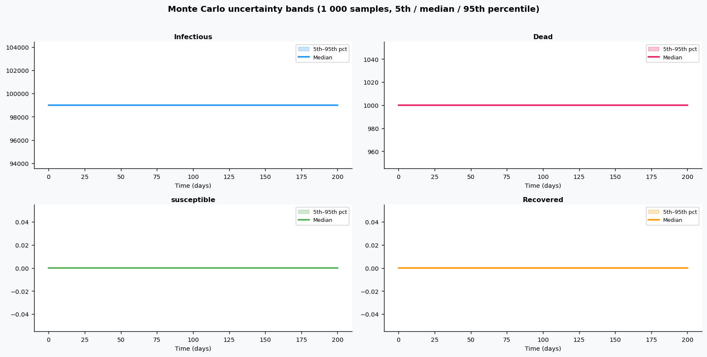

# Phase 4 — Uncertainty quantification: Covid3

This report summarizes parameter distributions (general framework), Monte Carlo simulation, and sensitivity analysis.

## Source model provenance

| Field | Value |
|-------|-------|
| Phase 3 fill mode | both |
| Phase 3 run dir | `covid3_gemini_phase3` |

---

## 1. Parameter distributions (Task 9.1)

Distributions are assigned using the **general framework** (typed parameter uncertainty): same distribution families and typical ranges for similar parameter types across diseases.

| Parameter | Type | Family | Low | High | Point | Note |
|-----------|------|--------|-----|------|-------|------|
| R_t | other | uniform | 0 | 1 | 0.5 | † |
| Initial R_t | other | uniform | 1.9 | 5.7 | 3.8 |  |
| Serial Interval Distribution | transmission | lognormal | 0.05 | 1 | 0.525 | † |
| Infection Fatality Ratio | contact | lognormal | 0.5 | 10 | 5.25 | † |
| Infection-to-death distribution | mortality | lognormal | 1e-05 | 0.02 | 0.01001 | † |
| Lockdown effect | other | uniform | 40.5 | 121.5 | 81 |  |
| population11countries | mortality | lognormal | 4.364e-05 | 0.0001976 | 0.0001 |  |
| generationintervaldays | mortality | lognormal | 4.364e-05 | 0.0001976 | 0.0001 |  |
| basetransmissionrate | transmission | lognormal | 5.388e-05 | 0.0001703 | 0.0001 |  |
| publiceventsbaneffect | mortality | lognormal | 4.364e-05 | 0.0001976 | 0.0001 |  |
| schoolclosureeffect | other | uniform | 5000 | 1.5e+04 | 1e+04 |  |
| selfisolationeffect | mortality | lognormal | 4.364e-05 | 0.0001976 | 0.0001 |  |
| socialdistancingeffect | mortality | lognormal | 4.364e-05 | 0.0001976 | 0.0001 |  |
| combinedinterventionmultiplier | mortality | lognormal | 4.364e-05 | 0.0001976 | 0.0001 |  |
| effectivetransmissionrate | transmission | lognormal | 5.388e-05 | 0.0001703 | 0.0001 |  |
| meanoutcomedelaydays | mortality | lognormal | 4.364e-05 | 0.0001976 | 0.0001 |  |
| removalrate | transmission | lognormal | 0.2694 | 0.8514 | 0.5 |  |
| deathrate | mortality | lognormal | 4364 | 1.976e+04 | 1e+04 |  |

† Range inferred from parameter type — no value recovered from paper text.

## 2. Monte Carlo simulation (Task 9.2)

- **Samples:** 1000   **Days:** 200   **Compartments:** Infectious, Dead, susceptible, Recovered

**Peak value spread (5th / 50th / 95th percentile across ensemble):**

| Compartment | P5 peak | P50 peak | P95 peak |
|-------------|---------|----------|----------|
| Infectious | 99000.00 | 99000.00 | 99000.00 |
| Dead | 1000.00 | 1000.00 | 1000.00 |
| susceptible | 0.00 | 0.00 | 0.00 |
| Recovered | 0.00 | 0.00 | 0.00 |

## 3. Sensitivity analysis (Task 9.3)

**Parameter ranking by combined impact on peak infections + total cases:**

| Rank | Parameter | Peak impact | Total cases impact | Combined |
|------|-----------|------------|-------------------|---------|
| 1 | R_t | 0.0000 | 0.0000 | 0.0000 |
| 2 | Initial R_t | 0.0000 | 0.0000 | 0.0000 |
| 3 | Serial Interval Distribution | 0.0000 | 0.0000 | 0.0000 |
| 4 | Infection Fatality Ratio | 0.0000 | 0.0000 | 0.0000 |
| 5 | Infection-to-death distribution | 0.0000 | 0.0000 | 0.0000 |
| 6 | Lockdown effect | 0.0000 | 0.0000 | 0.0000 |
| 7 | population11countries | 0.0000 | 0.0000 | 0.0000 |
| 8 | generationintervaldays | 0.0000 | 0.0000 | 0.0000 |
| 9 | basetransmissionrate | 0.0000 | 0.0000 | 0.0000 |
| 10 | publiceventsbaneffect | 0.0000 | 0.0000 | 0.0000 |

---
*Generated by Phase 4 (uncertainty quantification). Model: `covid3`. General framework: `phase 4/data/general_framework.json`.*