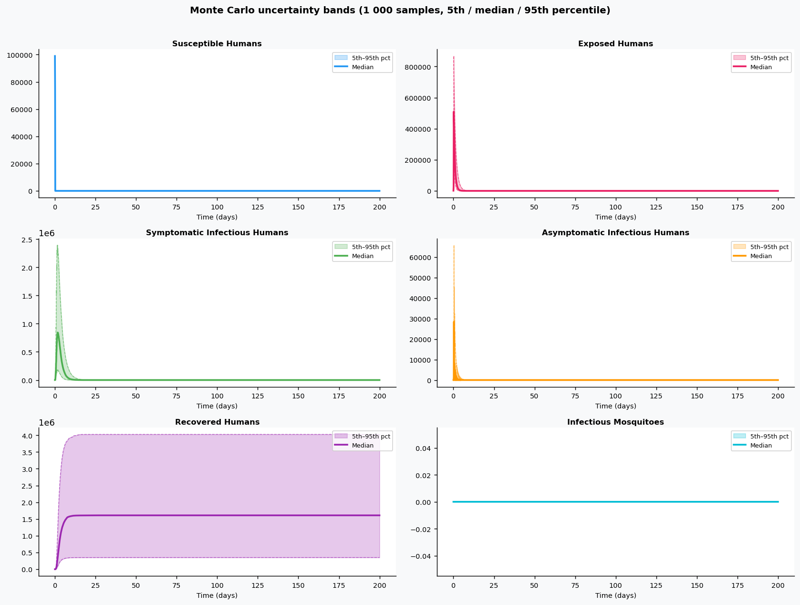
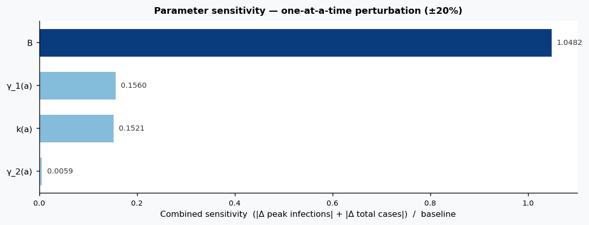

# Phase 4 — Uncertainty quantification: Dengue1

This report summarizes parameter distributions (general framework), Monte Carlo simulation, and sensitivity analysis.

## Source model provenance

| Field | Value |
|-------|-------|
| Phase 3 fill mode | retrieval_only |
| Phase 3 run dir | `dengue1_gemini_phase3` |

---

## 1. Parameter distributions (Task 9.1)

Distributions are assigned using the **general framework** (typed parameter uncertainty): same distribution families and typical ranges for similar parameter types across diseases.

| Parameter | Type | Family | Low | High | Point | Note |
|-----------|------|--------|-----|------|-------|------|
| B | other | uniform | 125 | 375 | 250 |  |
| k(a) | other | uniform | 0.3 | 0.9 | 0.6 |  |
| μ_h | mortality | lognormal | 0.002182 | 0.009878 | 0.005 |  |
| μ_v | mortality | lognormal | 0.2836 | 1.284 | 0.65 |  |
| γ_1(a) | recovery | lognormal | 0.2994 | 0.7859 | 0.5 |  |
| γ_2(a) | recovery | lognormal | 0.2994 | 0.7859 | 0.5 |  |
| β_v(a) | transmission | lognormal | 4.31 | 13.62 | 8 |  |
| β_h(a) | transmission | lognormal | 9.698 | 30.65 | 18 |  |
| ρ | progression | lognormal | 0.2694 | 0.8514 | 0.5 |  |
| σ | progression | lognormal | 0.003771 | 0.01192 | 0.007 |  |
| γ1 | recovery | lognormal | 0.5988 | 1.572 | 1 |  |
| γ2 | recovery | lognormal | 0.5988 | 1.572 | 1 |  |

## 2. Monte Carlo simulation (Task 9.2)

- **Samples:** 1000   **Days:** 200   **Compartments:** Susceptible Humans, Exposed Humans, Symptomatic Infectious Humans, Asymptomatic Infectious Humans, Recovered Humans, Infectious Mosquitoes

**Peak value spread (5th / 50th / 95th percentile across ensemble):**

| Compartment | P5 peak | P50 peak | P95 peak |
|-------------|---------|----------|----------|
| Susceptible Humans | 99000.00 | 99000.00 | 99000.00 |
| Exposed Humans | 184039.32 | 509907.34 | 867875.13 |
| Symptomatic Infectious Humans | 183047.14 | 843508.06 | 2393363.77 |
| Asymptomatic Infectious Humans | 10677.17 | 28469.91 | 65803.02 |
| Recovered Humans | 349342.28 | 1608959.12 | 4027767.08 |
| Infectious Mosquitoes | 0.00 | 0.00 | 0.00 |

## 3. Sensitivity analysis (Task 9.3)

**Parameter ranking by combined impact on peak infections + total cases:**

| Rank | Parameter | Peak impact | Total cases impact | Combined |
|------|-----------|------------|-------------------|---------|
| 1 | B | 1.0482 | 0.0000 | 1.0482 |
| 2 | γ_1(a) | -0.1560 | 0.0000 | 0.1560 |
| 3 | k(a) | 0.1521 | 0.0000 | 0.1521 |
| 4 | γ_2(a) | -0.0059 | 0.0000 | 0.0059 |
| 5 | μ_h | 0.0000 | 0.0000 | 0.0000 |
| 6 | μ_v | 0.0000 | 0.0000 | 0.0000 |
| 7 | β_v(a) | 0.0000 | 0.0000 | 0.0000 |
| 8 | β_h(a) | 0.0000 | 0.0000 | 0.0000 |
| 9 | ρ | 0.0000 | 0.0000 | 0.0000 |
| 10 | σ | 0.0000 | 0.0000 | 0.0000 |

---
*Generated by Phase 4 (uncertainty quantification). Model: `dengue1`. General framework: `phase 4/data/general_framework.json`.*