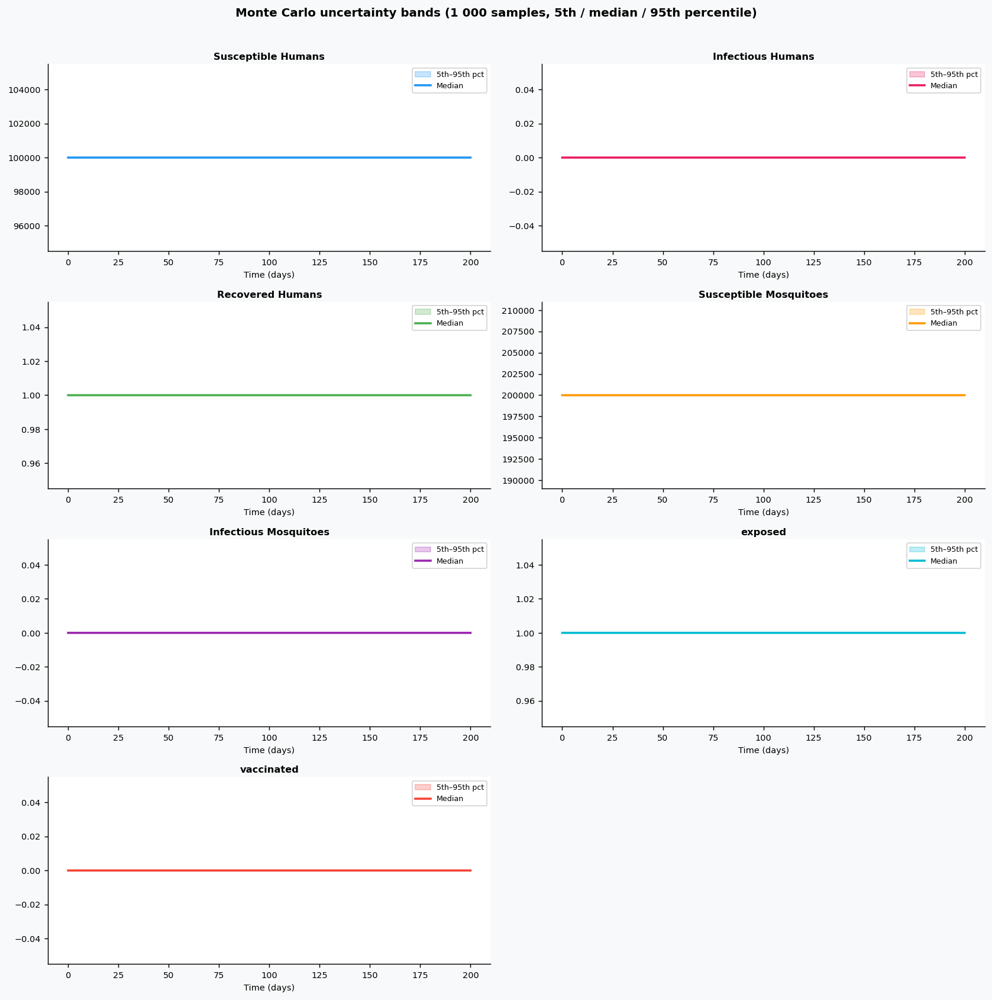

# Phase 4 — Uncertainty quantification: Dengue2

This report summarizes parameter distributions (general framework), Monte Carlo simulation, and sensitivity analysis.

## Source model provenance

| Field | Value |
|-------|-------|
| Phase 3 fill mode | retrieval_only |
| Phase 3 run dir | `dengue2_gemini_phase3` |

---

## 1. Parameter distributions (Task 9.1)

Distributions are assigned using the **general framework** (typed parameter uncertainty): same distribution families and typical ranges for similar parameter types across diseases.

| Parameter | Type | Family | Low | High | Point | Note |
|-----------|------|--------|-----|------|-------|------|
| Per-exposure protection from vaccination for seronegative vaccinees | other | uniform | 0.1605 | 0.4815 | 0.321 |  |
| Per-exposure protection from vaccination for seropositive vaccinees | other | uniform | 0.258 | 0.774 | 0.516 |  |
| Average duration of protection for seronegative vaccinees | recovery | lognormal | 255.1 | 669.6 | 426 |  |
| Average duration of protection for seropositive vaccinees | recovery | lognormal | 154.5 | 405.5 | 258 |  |
| Probability of symptoms conditional on infection (primary) | other | uniform | 0.2025 | 0.6075 | 0.405 |  |
| Probability of symptoms conditional on infection (secondary) | other | uniform | 0.1695 | 0.5085 | 0.339 |  |
| Probability of symptoms conditional on infection (post-secondary) | other | uniform | 0.045 | 0.135 | 0.09 |  |
| Probability of hospitalization conditional on symptoms (primary) | other | uniform | 0.037 | 0.111 | 0.074 |  |
| Probability of hospitalization conditional on symptoms (secondary) | other | uniform | 0.188 | 0.564 | 0.376 |  |
| Probability of hospitalization conditional on symptoms (post-secondary) | other | uniform | 0.0505 | 0.1515 | 0.101 |  |
| Probability of death conditional on symptomatic disease | mortality | lognormal | 0.003404 | 0.01541 | 0.0078 |  |
| Probability of mosquito to human transmission | transmission | lognormal | 0.05 | 1 | 0.525 | † |
| Mosquito emergence rate | other | uniform | 0 | 1 | 0.5 | † |
| transmissionrate | transmission | lognormal | 5.388e-05 | 0.0001703 | 0.0001 |  |
| incubationrate | mortality | lognormal | 4.364e-05 | 0.0001976 | 0.0001 |  |
| recoveryrate | transmission | lognormal | 0.2694 | 0.8514 | 0.5 |  |
| screeningandvaccinationrate | mortality | lognormal | 4.364e-05 | 0.0001976 | 0.0001 |  |
| vaccinebreakthroughrate | other | uniform | 5000 | 1.5e+04 | 1e+04 |  |

† Range inferred from parameter type — no value recovered from paper text.

## 2. Monte Carlo simulation (Task 9.2)

- **Samples:** 1000   **Days:** 200   **Compartments:** Susceptible Humans, Infectious Humans, Recovered Humans, Susceptible Mosquitoes, Infectious Mosquitoes, exposed, vaccinated

**Peak value spread (5th / 50th / 95th percentile across ensemble):**

| Compartment | P5 peak | P50 peak | P95 peak |
|-------------|---------|----------|----------|
| Susceptible Humans | 99999.00 | 99999.00 | 99999.00 |
| Infectious Humans | 0.00 | 0.00 | 0.00 |
| Recovered Humans | 1.00 | 1.00 | 1.00 |
| Susceptible Mosquitoes | 199999.00 | 199999.00 | 199999.00 |
| Infectious Mosquitoes | 0.00 | 0.00 | 0.00 |
| exposed | 1.00 | 1.00 | 1.00 |
| vaccinated | 0.00 | 0.00 | 0.00 |

## 3. Sensitivity analysis (Task 9.3)

**Parameter ranking by combined impact on peak infections + total cases:**

| Rank | Parameter | Peak impact | Total cases impact | Combined |
|------|-----------|------------|-------------------|---------|
| 1 | Per-exposure protection from vaccination for seronegative vaccinees | 0.0000 | 0.0000 | 0.0000 |
| 2 | Per-exposure protection from vaccination for seropositive vaccinees | 0.0000 | 0.0000 | 0.0000 |
| 3 | Average duration of protection for seronegative vaccinees | 0.0000 | 0.0000 | 0.0000 |
| 4 | Average duration of protection for seropositive vaccinees | 0.0000 | 0.0000 | 0.0000 |
| 5 | Probability of symptoms conditional on infection (primary) | 0.0000 | 0.0000 | 0.0000 |
| 6 | Probability of symptoms conditional on infection (secondary) | 0.0000 | 0.0000 | 0.0000 |
| 7 | Probability of symptoms conditional on infection (post-secondary) | 0.0000 | 0.0000 | 0.0000 |
| 8 | Probability of hospitalization conditional on symptoms (primary) | 0.0000 | 0.0000 | 0.0000 |
| 9 | Probability of hospitalization conditional on symptoms (secondary) | 0.0000 | 0.0000 | 0.0000 |
| 10 | Probability of hospitalization conditional on symptoms (post-secondary) | 0.0000 | 0.0000 | 0.0000 |

---
*Generated by Phase 4 (uncertainty quantification). Model: `dengue2`. General framework: `phase 4/data/general_framework.json`.*