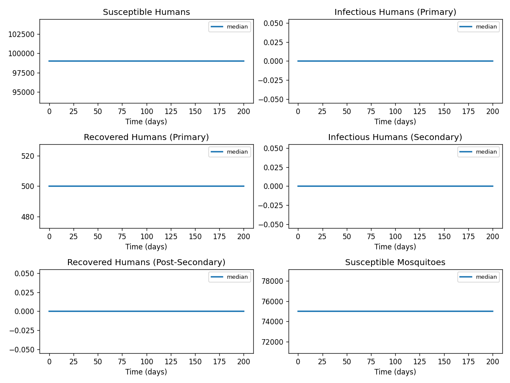
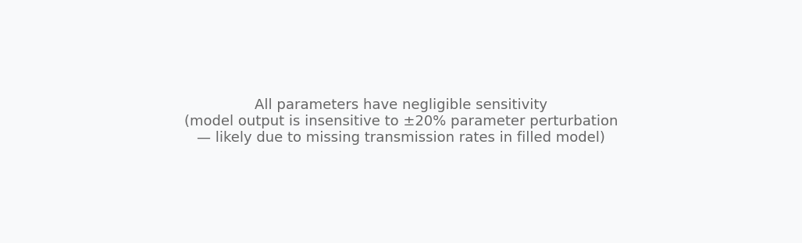

# Phase 4 — Uncertainty quantification: Dengue3

This report summarizes parameter distributions (general framework), Monte Carlo simulation, and sensitivity analysis.

## Source model provenance

| Field | Value |
|-------|-------|
| Phase 3 fill mode | retrieval_only |
| Phase 3 run dir | `dengue3_gemini_phase3` |

---

## 1. Parameter distributions (Task 9.1)

Distributions are assigned using the **general framework** (typed parameter uncertainty): same distribution families and typical ranges for similar parameter types across diseases.

| Parameter | Type | Family | Low | High | Point |
|-----------|------|--------|-----|------|-------|
| β_hv | transmission | lognormal | 0.0 | 0.0 | 0.0 |
| β_vh | transmission | lognormal | 0.0 | 0.0 | 0.0 |
| γ_h | recovery | lognormal | 0.0 | 0.0 | 0.0 |
| σ_v | progression | lognormal | 0.0 | 0.0 | 0.0 |
| μ_h | mortality | lognormal | 0.436351915275356 | 1.9756277796402941 | 1.0 |
| μ_v | mortality | lognormal | 0.0 | 0.0 | 0.0 |
| Case fatality rate | mortality | lognormal | 0.0003 | 0.0009 | 0.0006 |
| Default vaccine coverage | other | uniform | 0.4 | 1.2000000000000002 | 0.8 |
| Default vaccination age | other | uniform | 4.5 | 13.5 | 9.0 |
| Discount rate | other | uniform | 0.015 | 0.045 | 0.03 |
| DALYs per symptomatic dengue case | other | uniform | 0.003 | 0.009000000000000001 | 0.006 |
| DALYs per severe dengue case | other | uniform | 0.01 | 0.03 | 0.02 |
| Cost per hospitalised case (public payer, Latin America) | other | uniform | 100.0 | 300.0 | 200.0 |
| primarytransmissionrate | transmission | lognormal | 0.1400801052937908 | 0.44273488011578643 | 0.26 |
| incubationrate | progression | lognormal | 0.10775392714906984 | 0.3405652923967588 | 0.2 |
| recoveryrate | recovery | lognormal | 0.08382552745312725 | 0.220064929908666 | 0.14 |
| routinevaccinationrate | other | uniform | 0.025 | 0.07500000000000001 | 0.05 |
| naturalcrossprotectionwaningrate | other | uniform | 0.01 | 0.03 | 0.02 |
| vaccinecrossprotectionwaningrate | other | uniform | 0.015 | 0.045 | 0.03 |
| secondarytransmissionrate | transmission | lognormal | 0.1616308907236047 | 0.5108479385951381 | 0.3 |
| postvaccinationtransmissionrate | transmission | lognormal | 0.1293047125788838 | 0.4086783508761105 | 0.24 |

## 2. Monte Carlo simulation (Task 9.2)

- **Samples:** 1000   **Days:** 200   **Compartments:** Susceptible Humans, Infectious Humans (Primary), Recovered Humans (Primary), Infectious Humans (Secondary), Recovered Humans (Post-Secondary), Susceptible Mosquitoes, Exposed Mosquitoes, Infectious Mosquitoes, primarysusceptible, primaryexposed, primaryinfectious, postprimaryimmune, vaccinatedsilentinfection, secondarysusceptible, postvaccinationsusceptible, secondaryinfectious, postsecondaryimmune

**Peak value spread (5th / 50th / 95th percentile across ensemble):**

| Compartment | P5 peak | P50 peak | P95 peak |
|-------------|---------|----------|----------|
| Susceptible Humans | — | — | — |
| Infectious Humans (Primary) | — | — | — |
| Recovered Humans (Primary) | — | — | — |
| Infectious Humans (Secondary) | — | — | — |
| Recovered Humans (Post-Secondary) | — | — | — |
| Susceptible Mosquitoes | — | — | — |
| Exposed Mosquitoes | — | — | — |
| Infectious Mosquitoes | — | — | — |
| primarysusceptible | — | — | — |
| primaryexposed | — | — | — |

## 3. Sensitivity analysis (Task 9.3)

**Parameter ranking by combined impact on peak infections + total cases:**

| Rank | Parameter | Peak impact | Total cases impact | Combined |
|------|-----------|------------|-------------------|---------|
| 1 | β_hv | 0.0000 | 0.0000 | 0.0000 |
| 2 | β_vh | 0.0000 | 0.0000 | 0.0000 |
| 3 | γ_h | 0.0000 | 0.0000 | 0.0000 |
| 4 | σ_v | 0.0000 | 0.0000 | 0.0000 |
| 5 | μ_h | 0.0000 | 0.0000 | 0.0000 |
| 6 | μ_v | 0.0000 | 0.0000 | 0.0000 |
| 7 | Case fatality rate | 0.0000 | 0.0000 | 0.0000 |
| 8 | Default vaccine coverage | 0.0000 | 0.0000 | 0.0000 |
| 9 | Default vaccination age | 0.0000 | 0.0000 | 0.0000 |
| 10 | Discount rate | 0.0000 | 0.0000 | 0.0000 |

---
*Generated by Phase 4 (uncertainty quantification). Model: `dengue3`. General framework: `phase 4/data/general_framework.json`.*