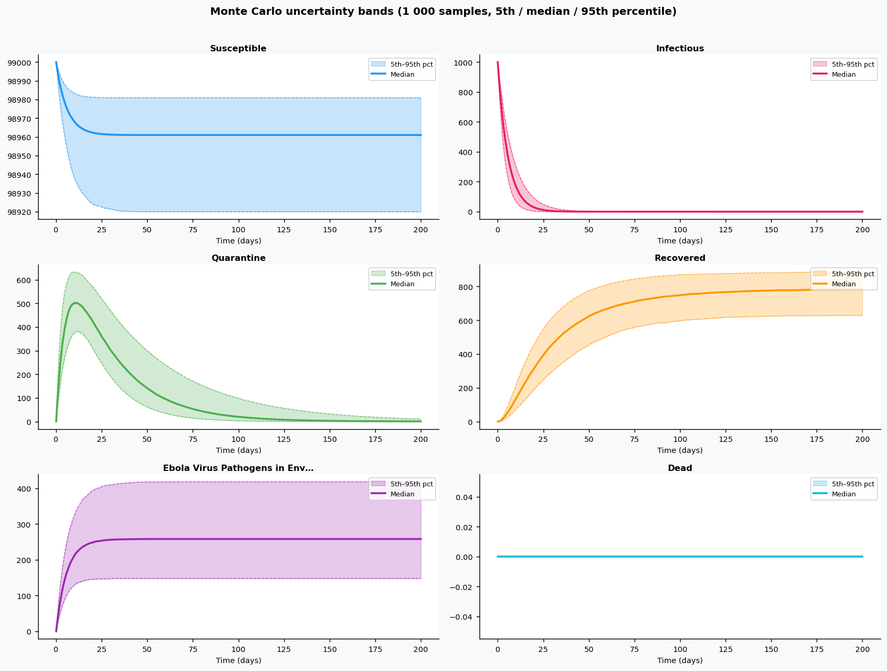
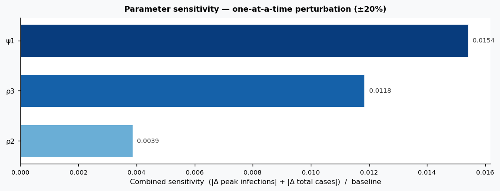

# Phase 4 — Uncertainty quantification: Ebola1

This report summarizes parameter distributions (general framework), Monte Carlo simulation, and sensitivity analysis.

## Source model provenance

| Field | Value |
|-------|-------|
| Phase 3 fill mode | retrieval_only |
| Phase 3 run dir | `ebola1_gemini_phase3` |

---

## 1. Parameter distributions (Task 9.1)

Distributions are assigned using the **general framework** (typed parameter uncertainty): same distribution families and typical ranges for similar parameter types across diseases.

| Parameter | Type | Family | Low | High | Point | Note |
|-----------|------|--------|-----|------|-------|------|
| α1 | other | uniform | 5 | 15 | 10 |  |
| α2 | other | uniform | 1.5 | 4.5 | 3 |  |
| ψ1 | contact | lognormal | 0.002909 | 0.01103 | 0.006 |  |
| ψ2 | contact | lognormal | 0.0005817 | 0.002205 | 0.0012 |  |
| ψ3 | contact | lognormal | 0.002909 | 0.01103 | 0.006 |  |
| ε | mortality | lognormal | 0.2182 | 0.9878 | 0.5 |  |
| ρ1 | mortality | lognormal | 0.05367 | 0.243 | 0.123 |  |
| ρ2 | progression | lognormal | 0.02155 | 0.06811 | 0.04 |  |
| ρ3 | progression | lognormal | 0.06465 | 0.2043 | 0.12 |  |
| w1 | other | uniform | 0.02 | 0.06 | 0.04 |  |
| w2 | other | uniform | 0.11 | 0.33 | 0.22 |  |
| h | other | uniform | 0.02 | 0.06 | 0.04 |  |
| c | other | uniform | 0.4 | 1.2 | 0.8 |  |
| b | other | uniform | 0 | 1 | 0.5 | † |
| d | other | uniform | 0.00075 | 0.00225 | 0.0015 |  |
| μ | mortality | lognormal | 4.582 | 20.74 | 10.5 |  |
| ω2 | transmission | lognormal | 0.2694 | 0.8514 | 0.5 |  |
| ω3 | transmission | lognormal | 0.2694 | 0.8514 | 0.5 |  |
| ω1 | transmission | lognormal | 0.2694 | 0.8514 | 0.5 |  |
| ω1q | transmission | lognormal | 0.2694 | 0.8514 | 0.5 |  |
| η | transmission | lognormal | 0.2694 | 0.8514 | 0.5 |  |

† Range inferred from parameter type — no value recovered from paper text.

## 2. Monte Carlo simulation (Task 9.2)

- **Samples:** 1000   **Days:** 200   **Compartments:** Susceptible, Infectious, Quarantine, Recovered, Ebola Virus Pathogens in Environment, Dead

**Peak value spread (5th / 50th / 95th percentile across ensemble):**

| Compartment | P5 peak | P50 peak | P95 peak |
|-------------|---------|----------|----------|
| Susceptible | 99000.00 | 99000.00 | 99000.00 |
| Infectious | 1000.00 | 1000.00 | 1000.00 |
| Quarantine | 381.33 | 502.31 | 633.00 |
| Recovered | 628.53 | 782.95 | 886.00 |
| Ebola Virus Pathogens in Environment | 147.89 | 258.31 | 418.45 |
| Dead | 0.00 | 0.00 | 0.00 |

## 3. Sensitivity analysis (Task 9.3)

**Parameter ranking by combined impact on peak infections + total cases:**

| Rank | Parameter | Peak impact | Total cases impact | Combined |
|------|-----------|------------|-------------------|---------|
| 1 | ψ1 | 0.0000 | 0.0154 | 0.0154 |
| 2 | ρ3 | 0.0000 | -0.0118 | 0.0118 |
| 3 | ρ2 | 0.0000 | -0.0039 | 0.0039 |
| 4 | α1 | 0.0000 | 0.0000 | 0.0000 |
| 5 | α2 | 0.0000 | 0.0000 | 0.0000 |
| 6 | ψ2 | 0.0000 | 0.0000 | 0.0000 |
| 7 | ψ3 | 0.0000 | 0.0000 | 0.0000 |
| 8 | ε | 0.0000 | 0.0000 | 0.0000 |
| 9 | ρ1 | 0.0000 | 0.0000 | 0.0000 |
| 10 | w1 | 0.0000 | 0.0000 | 0.0000 |

---
*Generated by Phase 4 (uncertainty quantification). Model: `ebola1`. General framework: `phase 4/data/general_framework.json`.*