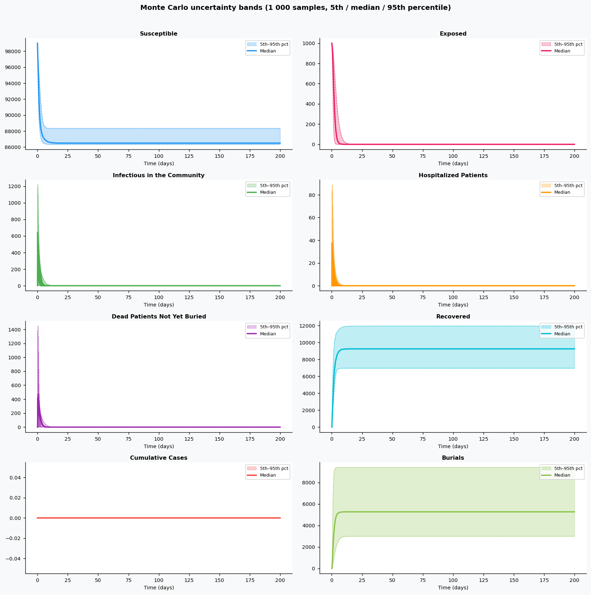
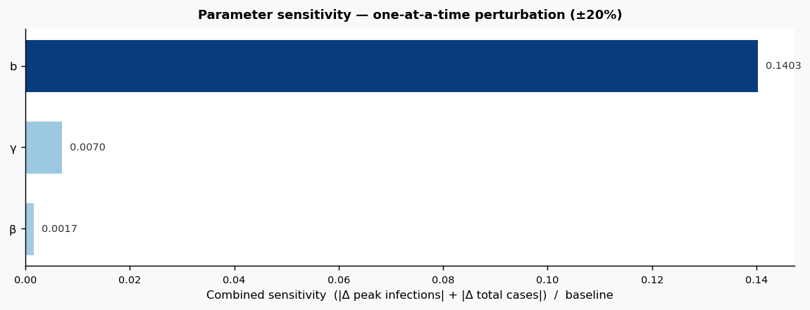

# Phase 4 — Uncertainty quantification: Ebola2

This report summarizes parameter distributions (general framework), Monte Carlo simulation, and sensitivity analysis.

## Source model provenance

| Field | Value |
|-------|-------|
| Phase 3 fill mode | retrieval_only |
| Phase 3 run dir | `ebola2_gemini_phase3` |

---

## 1. Parameter distributions (Task 9.1)

Distributions are assigned using the **general framework** (typed parameter uncertainty): same distribution families and typical ranges for similar parameter types across diseases.

| Parameter | Type | Family | Low | High | Point | Note |
|-----------|------|--------|-----|------|-------|------|
| β | transmission | lognormal | 0.2866 | 0.9059 | 0.532 |  |
| θ | transmission | lognormal | 0.1767 | 0.5585 | 0.328 |  |
| φ | transmission | lognormal | 1.134 | 3.583 | 2.104 |  |
| η | contact | lognormal | 2.327 | 8.821 | 4.8 |  |
| b | mortality | lognormal | 2.356 | 10.67 | 5.4 |  |
| γ | recovery | lognormal | 6.227 | 16.35 | 10.4 |  |
| α | recovery | lognormal | 5.988 | 15.72 | 10 |  |
| γH | recovery | lognormal | 2.754 | 7.231 | 4.6 |  |
| δ | mortality | lognormal | 31.85 | 144.2 | 73 |  |
| δH | mortality | lognormal | 26.62 | 120.5 | 61 |  |
| κ | other | uniform | 0.00125 | 0.00375 | 0.0025 |  |
| hospitalizationrate | other | uniform | 5000 | 1.5e+04 | 1e+04 |  |
| recoveryrate | transmission | lognormal | 0.2694 | 0.8514 | 0.5 |  |
| deathratecommunity | mortality | lognormal | 4364 | 1.976e+04 | 1e+04 |  |
| recoveryratehospital | recovery | lognormal | 5988 | 1.572e+04 | 1e+04 |  |
| deathratehospital | mortality | lognormal | 4364 | 1.976e+04 | 1e+04 |  |

## 2. Monte Carlo simulation (Task 9.2)

- **Samples:** 1000   **Days:** 200   **Compartments:** Susceptible, Exposed, Infectious in the Community, Hospitalized Patients, Dead Patients Not Yet Buried, Recovered, Cumulative Cases, Burials

**Peak value spread (5th / 50th / 95th percentile across ensemble):**

| Compartment | P5 peak | P50 peak | P95 peak |
|-------------|---------|----------|----------|
| Susceptible | 99000.00 | 99000.00 | 99000.00 |
| Exposed | 1000.00 | 1000.00 | 1000.00 |
| Infectious in the Community | 332.62 | 644.80 | 1219.51 |
| Hospitalized Patients | 16.37 | 37.67 | 88.97 |
| Dead Patients Not Yet Buried | 223.88 | 468.97 | 1448.31 |
| Recovered | 6966.48 | 9254.25 | 11962.73 |
| Cumulative Cases | 0.00 | 0.00 | 0.00 |
| Burials | 3003.17 | 5272.68 | 9408.68 |

## 3. Sensitivity analysis (Task 9.3)

**Parameter ranking by combined impact on peak infections + total cases:**

| Rank | Parameter | Peak impact | Total cases impact | Combined |
|------|-----------|------------|-------------------|---------|
| 1 | b | 0.1393 | -0.0010 | 0.1403 |
| 2 | γ | 0.0000 | -0.0070 | 0.0070 |
| 3 | β | 0.0000 | -0.0017 | 0.0017 |
| 4 | θ | 0.0000 | 0.0000 | 0.0000 |
| 5 | φ | 0.0000 | 0.0000 | 0.0000 |
| 6 | η | 0.0000 | 0.0000 | 0.0000 |
| 7 | α | 0.0000 | 0.0000 | 0.0000 |
| 8 | γH | 0.0000 | 0.0000 | 0.0000 |
| 9 | δ | 0.0000 | 0.0000 | 0.0000 |
| 10 | δH | 0.0000 | 0.0000 | 0.0000 |

---
*Generated by Phase 4 (uncertainty quantification). Model: `ebola2`. General framework: `phase 4/data/general_framework.json`.*