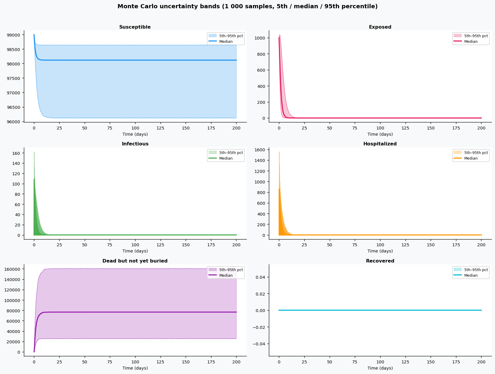
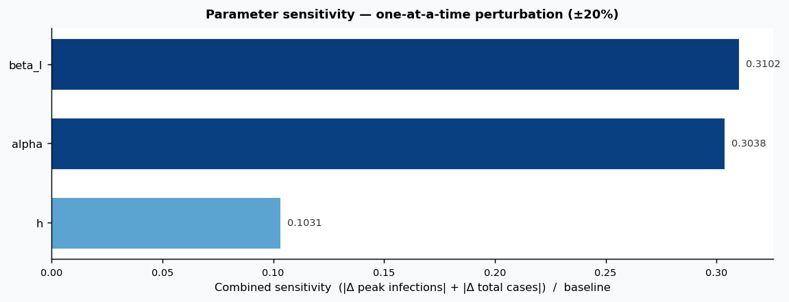

# Phase 4 — Uncertainty quantification: Ebola3

This report summarizes parameter distributions (general framework), Monte Carlo simulation, and sensitivity analysis.

## Source model provenance

| Field | Value |
|-------|-------|
| Phase 3 fill mode | retrieval_only |
| Phase 3 run dir | `ebola3_gemini_phase3` |

---

## 1. Parameter distributions (Task 9.1)

Distributions are assigned using the **general framework** (typed parameter uncertainty): same distribution families and typical ranges for similar parameter types across diseases.

| Parameter | Type | Family | Low | High | Point | Note |
|-----------|------|--------|-----|------|-------|------|
| beta_I | transmission | lognormal | 0.3168 | 1.001 | 0.588 |  |
| beta_H | transmission | lognormal | 0.4278 | 1.352 | 0.794 |  |
| beta_F | transmission | lognormal | 4.123 | 13.03 | 7.653 |  |
| alpha | recovery | lognormal | 0.5988 | 1.572 | 1 |  |
| 1/c_h | recovery | lognormal | 2.994 | 7.859 | 5 |  |
| 1/c_d | recovery | lognormal | 5.748 | 15.09 | 9.6 |  |
| 1/c_i | recovery | lognormal | 5.988 | 15.72 | 10 |  |
| 1/c_f | recovery | lognormal | 1.198 | 3.144 | 2 |  |
| h | other | uniform | 40 | 120 | 80 |  |
| d | other | uniform | 40.5 | 121.5 | 81 |  |
| h_1 | other | uniform | 0.335 | 1.005 | 0.67 |  |
| d_1 | mortality | lognormal | 0.3491 | 1.581 | 0.8 |  |
| d_2 | mortality | lognormal | 0.3491 | 1.581 | 0.8 |  |
| N | other | uniform | 1e+05 | 3e+05 | 2e+05 |  |
| R_0 | other | uniform | 1.9 | 2.8 | 2.35 |  |
| R_0I | mortality | lognormal | 0.2182 | 0.9878 | 0.5 |  |
| R_0H | other | uniform | 0.2 | 0.6 | 0.4 |  |
| R_0F | other | uniform | 0.9 | 2.7 | 1.8 |  |
| 1-z | transmission | lognormal | 6.465 | 20.43 | 12 |  |
| burialrate | transmission | lognormal | 0.2694 | 0.8514 | 0.5 |  |

## 2. Monte Carlo simulation (Task 9.2)

- **Samples:** 1000   **Days:** 200   **Compartments:** Susceptible, Exposed, Infectious, Hospitalized, Dead but not yet buried, Recovered

**Peak value spread (5th / 50th / 95th percentile across ensemble):**

| Compartment | P5 peak | P50 peak | P95 peak |
|-------------|---------|----------|----------|
| Susceptible | 99000.00 | 99000.00 | 99000.00 |
| Exposed | 1000.00 | 1000.00 | 1037.67 |
| Infectious | 73.97 | 108.66 | 162.47 |
| Hospitalized | 435.29 | 856.60 | 1561.04 |
| Dead but not yet buried | 25574.51 | 76673.13 | 160647.00 |
| Recovered | 0.00 | 0.00 | 0.00 |

## 3. Sensitivity analysis (Task 9.3)

**Parameter ranking by combined impact on peak infections + total cases:**

| Rank | Parameter | Peak impact | Total cases impact | Combined |
|------|-----------|------------|-------------------|---------|
| 1 | beta_I | 0.0220 | 0.2882 | 0.3102 |
| 2 | alpha | 0.0000 | -0.3038 | 0.3038 |
| 3 | h | 0.0000 | -0.1031 | 0.1031 |
| 4 | beta_H | 0.0000 | 0.0000 | 0.0000 |
| 5 | beta_F | 0.0000 | 0.0000 | 0.0000 |
| 6 | 1/c_h | 0.0000 | 0.0000 | 0.0000 |
| 7 | 1/c_d | 0.0000 | 0.0000 | 0.0000 |
| 8 | 1/c_i | 0.0000 | 0.0000 | 0.0000 |
| 9 | 1/c_f | 0.0000 | 0.0000 | 0.0000 |
| 10 | d | 0.0000 | 0.0000 | 0.0000 |

---
*Generated by Phase 4 (uncertainty quantification). Model: `ebola3`. General framework: `phase 4/data/general_framework.json`.*