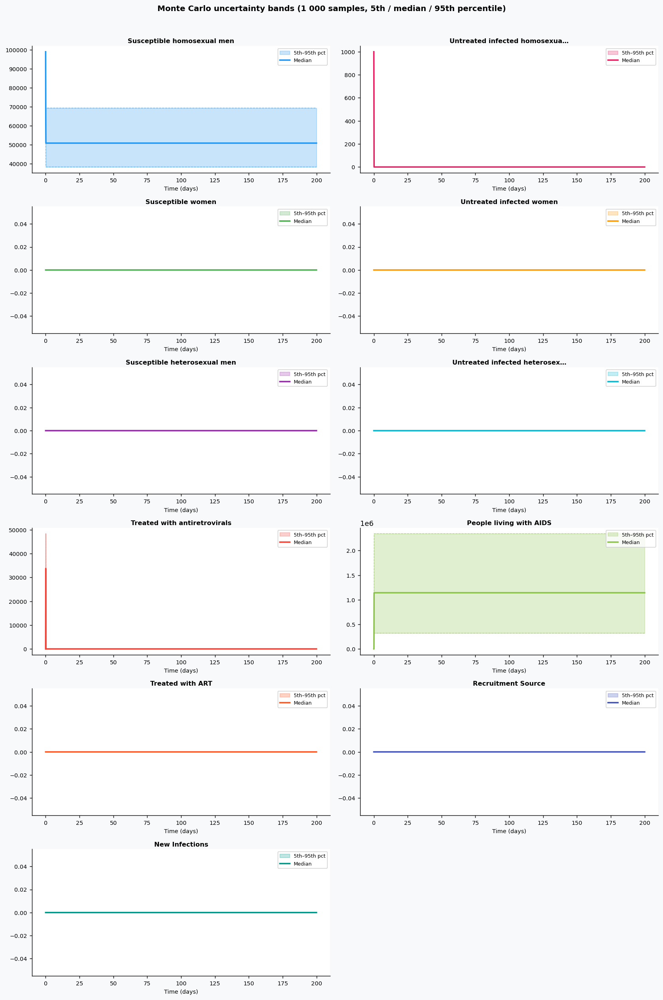
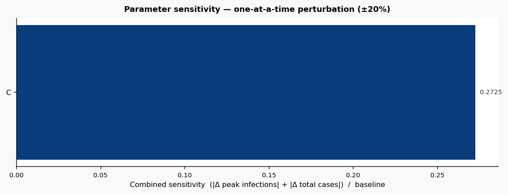

# Phase 4 — Uncertainty quantification: Hiv1

This report summarizes parameter distributions (general framework), Monte Carlo simulation, and sensitivity analysis.

## Source model provenance

| Field | Value |
|-------|-------|
| Phase 3 fill mode | both |
| Phase 3 run dir | `hiv1_gemini_phase3` |

---

## 1. Parameter distributions (Task 9.1)

Distributions are assigned using the **general framework** (typed parameter uncertainty): same distribution families and typical ranges for similar parameter types across diseases.

| Parameter | Type | Family | Low | High | Point | Note |
|-----------|------|--------|-----|------|-------|------|
| C | other | uniform | 166.5 | 499.5 | 333 |  |
| h | other | uniform | 0.24 | 0.72 | 0.48 |  |
| c | other | uniform | 0.46 | 1.38 | 0.92 |  |
| p | other | uniform | 0.45 | 1.35 | 0.9 |  |
| l | mortality | lognormal | 0.005629 | 0.02549 | 0.0129 |  |
| d | mortality | lognormal | 0.1454 | 0.6585 | 0.3333 |  |
| a | other | uniform | 0.1666 | 0.5 | 0.3333 |  |
| b_s | transmission | lognormal | 0.01078 | 0.03406 | 0.02 |  |
| b_h | transmission | lognormal | 0.2371 | 0.7492 | 0.44 |  |
| b_hw | transmission | lognormal | 0.009698 | 0.03065 | 0.018 |  |
| b_hm | transmission | lognormal | 0.1347 | 0.4257 | 0.25 |  |
| c_s | other | uniform | 2 | 6 | 4 |  |
| c_h | other | uniform | 3.5 | 10.5 | 7 |  |
| c_hw | other | uniform | 1 | 3 | 2 |  |
| c_hm | other | uniform | 0.5 | 1.5 | 1 |  |

## 2. Monte Carlo simulation (Task 9.2)

- **Samples:** 1000   **Days:** 200   **Compartments:** Susceptible homosexual men, Untreated infected homosexual men, Susceptible women, Untreated infected women, Susceptible heterosexual men, Untreated infected heterosexual men, Treated with antiretrovirals, People living with AIDS, Treated with ART, Recruitment Source, New Infections

**Peak value spread (5th / 50th / 95th percentile across ensemble):**

| Compartment | P5 peak | P50 peak | P95 peak |
|-------------|---------|----------|----------|
| Susceptible homosexual men | 99000.00 | 99000.00 | 99000.00 |
| Untreated infected homosexual men | 1000.00 | 1000.00 | 1000.00 |
| Susceptible women | 0.00 | 0.00 | 0.00 |
| Untreated infected women | 0.00 | 0.00 | 0.00 |
| Susceptible heterosexual men | 0.00 | 0.00 | 0.00 |
| Untreated infected heterosexual men | 0.00 | 0.00 | 0.00 |
| Treated with antiretrovirals | 17891.67 | 33798.72 | 48428.30 |
| People living with AIDS | 320111.83 | 1142353.99 | 2345300.42 |
| Treated with ART | 0.00 | 0.00 | 0.00 |
| Recruitment Source | 0.00 | 0.00 | 0.00 |

## 3. Sensitivity analysis (Task 9.3)

**Parameter ranking by combined impact on peak infections + total cases:**

| Rank | Parameter | Peak impact | Total cases impact | Combined |
|------|-----------|------------|-------------------|---------|
| 1 | C | 0.0000 | 0.2725 | 0.2725 |
| 2 | h | 0.0000 | 0.0000 | 0.0000 |
| 3 | c | 0.0000 | 0.0000 | 0.0000 |
| 4 | p | 0.0000 | 0.0000 | 0.0000 |
| 5 | l | 0.0000 | 0.0000 | 0.0000 |
| 6 | d | 0.0000 | 0.0000 | 0.0000 |
| 7 | a | 0.0000 | 0.0000 | 0.0000 |
| 8 | b_s | 0.0000 | 0.0000 | 0.0000 |
| 9 | b_h | 0.0000 | 0.0000 | 0.0000 |
| 10 | b_hw | 0.0000 | 0.0000 | 0.0000 |

---
*Generated by Phase 4 (uncertainty quantification). Model: `hiv1`. General framework: `phase 4/data/general_framework.json`.*