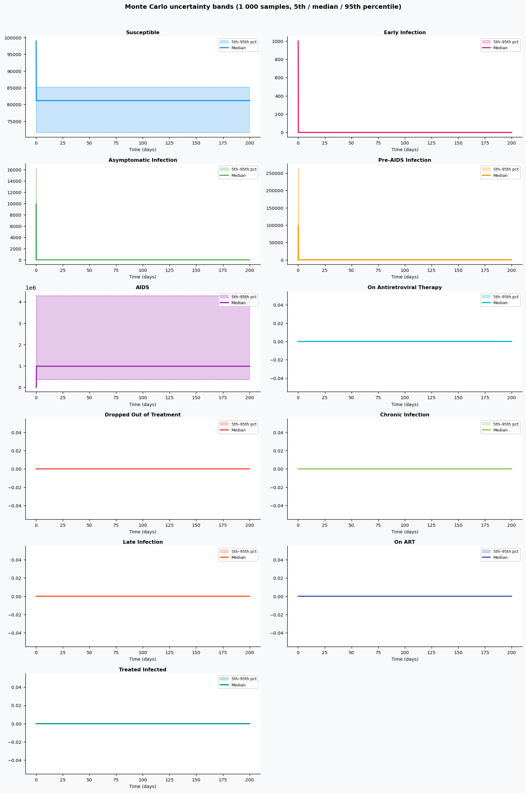
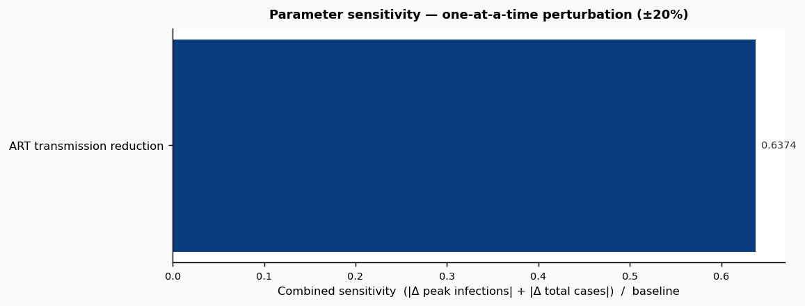

# Phase 4 — Uncertainty quantification: Hiv2

This report summarizes parameter distributions (general framework), Monte Carlo simulation, and sensitivity analysis.

## Source model provenance

| Field | Value |
|-------|-------|
| Phase 3 fill mode | llm_only |
| Phase 3 run dir | `hiv2_gemini_phase3` |

---

## 1. Parameter distributions (Task 9.1)

Distributions are assigned using the **general framework** (typed parameter uncertainty): same distribution families and typical ranges for similar parameter types across diseases.

| Parameter | Type | Family | Low | High | Point | Note |
|-----------|------|--------|-----|------|-------|------|
| CD4 treatment eligibility threshold | other | uniform | 100 | 300 | 200 |  |
| Average time from eligibility to treatment initiation | other | uniform | 0.5 | 1.5 | 1 |  |
| Treatment access | other | uniform | 25 | 75 | 50 |  |
| Retention on treatment after 3 years | mortality | lognormal | 32.73 | 148.2 | 75 |  |
| ART introduction time | other | uniform | 1006 | 3018 | 2012 |  |
| Baseline future scale-up ART starts | other | uniform | 200 | 600 | 400 |  |
| Low future scale-up ART starts | other | uniform | 2012 | 2016 | 2014 |  |
| Medium future scale-up ART starts | other | uniform | 2012 | 2016 | 2014 |  |
| High future scale-up ART starts | other | uniform | 2012 | 2016 | 2014 |  |
| ART transmission reduction | transmission | lognormal | 48.49 | 153.3 | 90 |  |
| Early infection transmissibility increase | other | uniform | 5 | 15 | 10 |  |
| betaearly | transmission | lognormal | 0.0002694 | 0.0008514 | 0.0005 |  |
| betachronic | transmission | lognormal | 2.694e-05 | 8.514e-05 | 5e-05 |  |
| betalate | transmission | lognormal | 0.002694 | 0.008514 | 0.005 |  |
| betaart | transmission | lognormal | 0.00431 | 0.01362 | 0.008 |  |
| progression1 | progression | lognormal | 0.05388 | 0.1703 | 0.1 |  |
| progression2 | progression | lognormal | 0.02694 | 0.08514 | 0.05 |  |
| artstart1 | other | uniform | 175 | 525 | 350 |  |
| artstart2 | other | uniform | 175 | 525 | 350 |  |
| deathlate | mortality | lognormal | 0.02182 | 0.09878 | 0.05 |  |
| deathart | mortality | lognormal | 0.01309 | 0.05927 | 0.03 |  |

## 2. Monte Carlo simulation (Task 9.2)

- **Samples:** 1000   **Days:** 200   **Compartments:** Susceptible, Early Infection, Asymptomatic Infection, Pre-AIDS Infection, AIDS, On Antiretroviral Therapy, Dropped Out of Treatment, Chronic Infection, Late Infection, On ART, Treated Infected

**Peak value spread (5th / 50th / 95th percentile across ensemble):**

| Compartment | P5 peak | P50 peak | P95 peak |
|-------------|---------|----------|----------|
| Susceptible | 99000.00 | 99000.00 | 99000.00 |
| Early Infection | 1000.00 | 1000.00 | 1000.00 |
| Asymptomatic Infection | 6218.10 | 9943.02 | 16239.45 |
| Pre-AIDS Infection | 38664.76 | 98863.65 | 263719.59 |
| AIDS | 365566.62 | 983003.32 | 4282660.23 |
| On Antiretroviral Therapy | 0.00 | 0.00 | 0.00 |
| Dropped Out of Treatment | 0.00 | 0.00 | 0.00 |
| Chronic Infection | 0.00 | 0.00 | 0.00 |
| Late Infection | 0.00 | 0.00 | 0.00 |
| On ART | 0.00 | 0.00 | 0.00 |

## 3. Sensitivity analysis (Task 9.3)

**Parameter ranking by combined impact on peak infections + total cases:**

| Rank | Parameter | Peak impact | Total cases impact | Combined |
|------|-----------|------------|-------------------|---------|
| 1 | ART transmission reduction | 0.4000 | 0.2374 | 0.6374 |
| 2 | CD4 treatment eligibility threshold | 0.0000 | 0.0000 | 0.0000 |
| 3 | Average time from eligibility to treatment initiation | 0.0000 | 0.0000 | 0.0000 |
| 4 | Treatment access | 0.0000 | 0.0000 | 0.0000 |
| 5 | Retention on treatment after 3 years | 0.0000 | 0.0000 | 0.0000 |
| 6 | ART introduction time | 0.0000 | 0.0000 | 0.0000 |
| 7 | Baseline future scale-up ART starts | 0.0000 | 0.0000 | 0.0000 |
| 8 | Low future scale-up ART starts | 0.0000 | 0.0000 | 0.0000 |
| 9 | Medium future scale-up ART starts | 0.0000 | 0.0000 | 0.0000 |
| 10 | High future scale-up ART starts | 0.0000 | 0.0000 | 0.0000 |

---
*Generated by Phase 4 (uncertainty quantification). Model: `hiv2`. General framework: `phase 4/data/general_framework.json`.*