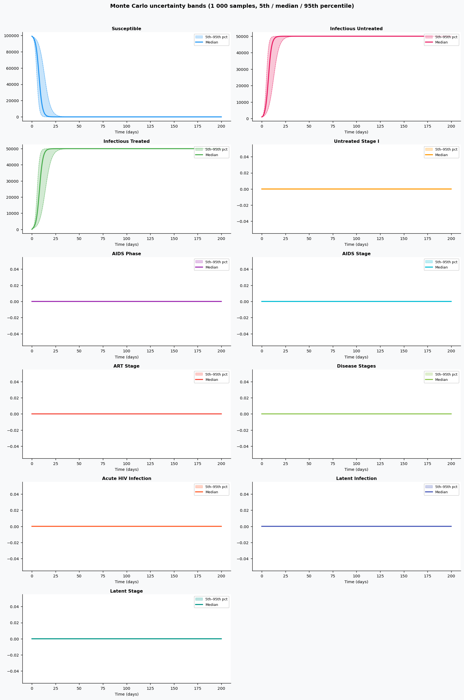
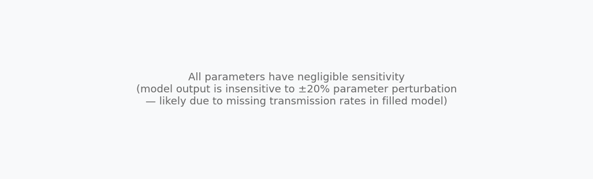

# Phase 4 — Uncertainty quantification: Hiv3

This report summarizes parameter distributions (general framework), Monte Carlo simulation, and sensitivity analysis.

## Source model provenance

| Field | Value |
|-------|-------|
| Phase 3 fill mode | both |
| Phase 3 run dir | `hiv3_gemini_phase3` |

---

## 1. Parameter distributions (Task 9.1)

Distributions are assigned using the **general framework** (typed parameter uncertainty): same distribution families and typical ranges for similar parameter types across diseases.

| Parameter | Type | Family | Low | High | Point | Note |
|-----------|------|--------|-----|------|-------|------|
| δ | mortality | lognormal | 0.01265 | 0.05729 | 0.029 |  |
| μ | mortality | lognormal | 0.007854 | 0.03556 | 0.018 |  |
| β | transmission | lognormal | 0.4132 | 1.306 | 0.767 |  |
| ρ | transmission | lognormal | 0.02963 | 0.09366 | 0.055 |  |
| ν | transmission | lognormal | 0.5366 | 1.696 | 0.996 |  |
| ε | transmission | lognormal | 0.005388 | 0.01703 | 0.01 |  |
| γ_U | recovery | lognormal | 0.1814 | 0.4763 | 0.303 |  |
| γ_T | recovery | lognormal | 0.09879 | 0.2594 | 0.165 |  |
| τ | progression | lognormal | 1083 | 3424 | 2011 |  |
| r | other | uniform | 0.5 | 1.5 | 1 |  |
| m | mortality | lognormal | 0.3927 | 1.778 | 0.9 |  |
| ψ | other | uniform | 0.5 | 1.5 | 1 |  |
| θ | other | uniform | 0.04 | 0.12 | 0.08 |  |
| ω | other | uniform | 0.0075 | 0.0225 | 0.015 |  |
| α | other | uniform | 0.05 | 0.15 | 0.1 |  |
| φ | transmission | lognormal | 0.2155 | 0.6811 | 0.4 |  |

## 2. Monte Carlo simulation (Task 9.2)

- **Samples:** 1000   **Days:** 200   **Compartments:** Susceptible, Infectious Untreated, Infectious Treated, Untreated Stage I, AIDS Phase, AIDS Stage, ART Stage, Disease Stages, Acute HIV Infection, Latent Infection, Latent Stage

**Peak value spread (5th / 50th / 95th percentile across ensemble):**

| Compartment | P5 peak | P50 peak | P95 peak |
|-------------|---------|----------|----------|
| Susceptible | 99000.00 | 99000.00 | 99000.00 |
| Infectious Untreated | 50000.00 | 50000.00 | 50000.00 |
| Infectious Treated | 50000.00 | 50000.00 | 50000.00 |
| Untreated Stage I | 0.00 | 0.00 | 0.00 |
| AIDS Phase | 0.00 | 0.00 | 0.00 |
| AIDS Stage | 0.00 | 0.00 | 0.00 |
| ART Stage | 0.00 | 0.00 | 0.00 |
| Disease Stages | 0.00 | 0.00 | 0.00 |
| Acute HIV Infection | 0.00 | 0.00 | 0.00 |
| Latent Infection | 0.00 | 0.00 | 0.00 |

## 3. Sensitivity analysis (Task 9.3)

**Parameter ranking by combined impact on peak infections + total cases:**

| Rank | Parameter | Peak impact | Total cases impact | Combined |
|------|-----------|------------|-------------------|---------|
| 1 | r | 0.0000 | 0.0000 | 0.0000 |
| 2 | δ | 0.0000 | 0.0000 | 0.0000 |
| 3 | μ | 0.0000 | 0.0000 | 0.0000 |
| 4 | β | 0.0000 | 0.0000 | 0.0000 |
| 5 | ρ | 0.0000 | 0.0000 | 0.0000 |
| 6 | ν | 0.0000 | 0.0000 | 0.0000 |
| 7 | ε | 0.0000 | 0.0000 | 0.0000 |
| 8 | γ_U | 0.0000 | 0.0000 | 0.0000 |
| 9 | γ_T | 0.0000 | 0.0000 | 0.0000 |
| 10 | τ | 0.0000 | 0.0000 | 0.0000 |

---
*Generated by Phase 4 (uncertainty quantification). Model: `hiv3`. General framework: `phase 4/data/general_framework.json`.*