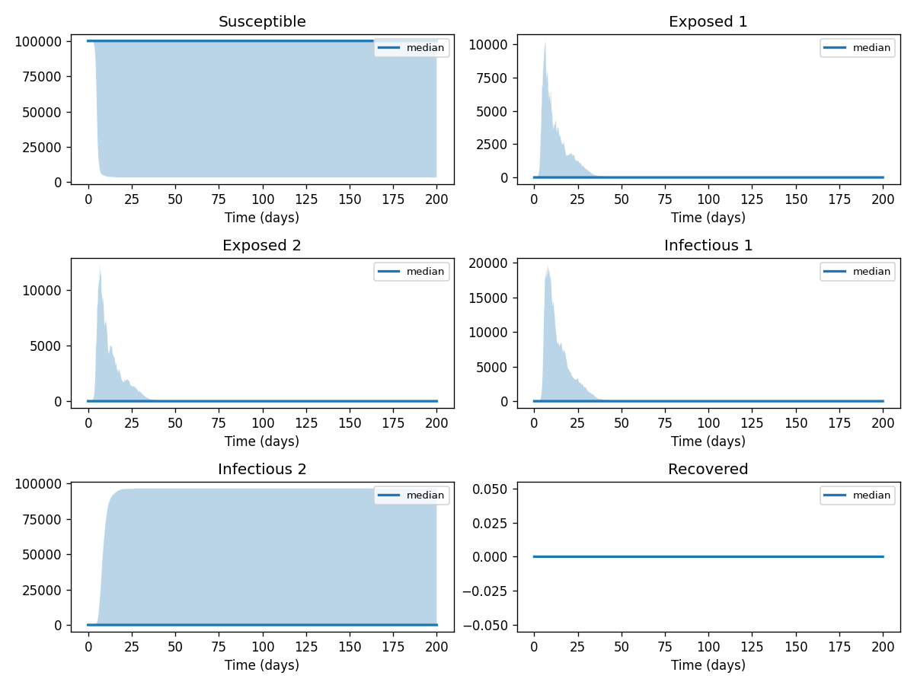
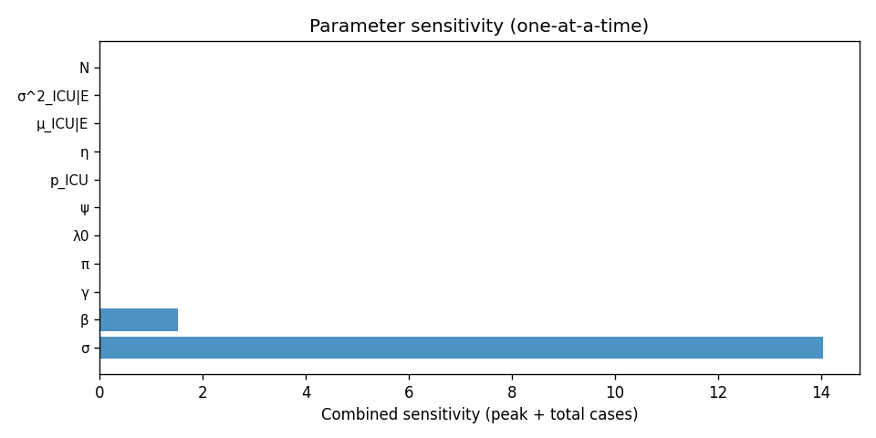

# Phase 4 — Uncertainty quantification: Influenza1

This report summarizes parameter distributions (general framework), Monte Carlo simulation, and sensitivity analysis.

## Source model provenance

| Field | Value |
|-------|-------|
| Phase 3 fill mode | rag_only |
| Phase 3 run dir | `influenza1_gemini_phase3` |

---

## 1. Parameter distributions (Task 9.1)

Distributions are assigned using the **general framework** (typed parameter uncertainty): same distribution families and typical ranges for similar parameter types across diseases.

| Parameter | Type | Family | Low | High | Point |
|-----------|------|--------|-----|------|-------|
| π | other | uniform | 0.0 | 0.0 | 0.0 |
| λ0 | transmission | lognormal | 0.0 | 0.0 | 0.0 |
| ψ | other | uniform | 0.0 | 0.0 | 0.0 |
| β | transmission | lognormal | 0.01 | 1.0 | 0.505 |
| σ | progression | lognormal | 0.5387696357453492 | 1.702826461983794 | 1.0 |
| γ | recovery | lognormal | 0.3470975590326991 | 0.9112259990575264 | 0.5797 |
| p_ICU | other | uniform | 0.0 | 0.0 | 0.0 |
| η | contact | lognormal | 0.4847804928769282 | 1.8376741844439803 | 1.0 |
| µ_ICU|E | other | uniform | 2.854 | 8.562000000000001 | 5.708 |
| σ^2_ICU|E | progression | lognormal | 9.827158155995171 | 31.0595546665844 | 18.24 |
| N | other | uniform | 0.0 | 1.0 | 0.5 |

## 2. Monte Carlo simulation (Task 9.2)

- **Samples:** 1000   **Days:** 200   **Compartments:** Susceptible, Exposed 1, Exposed 2, Infectious 1, Infectious 2, Recovered

**Peak value spread (5th / 50th / 95th percentile across ensemble):**

| Compartment | P5 peak | P50 peak | P95 peak |
|-------------|---------|----------|----------|
| Susceptible | — | — | — |
| Exposed 1 | — | — | — |
| Exposed 2 | — | — | — |
| Infectious 1 | — | — | — |
| Infectious 2 | — | — | — |
| Recovered | — | — | — |

## 3. Sensitivity analysis (Task 9.3)

**Parameter ranking by combined impact on peak infections + total cases:**

| Rank | Parameter | Peak impact | Total cases impact | Combined |
|------|-----------|------------|-------------------|---------|
| 1 | σ | 0.0000 | 0.0000 | 14.0488 |
| 2 | β | 0.0000 | 0.0000 | 1.5126 |
| 3 | γ | 0.0000 | 0.0000 | 0.0000 |
| 4 | π | 0.0000 | 0.0000 | 0.0000 |
| 5 | λ0 | 0.0000 | 0.0000 | 0.0000 |
| 6 | ψ | 0.0000 | 0.0000 | 0.0000 |
| 7 | p_ICU | 0.0000 | 0.0000 | 0.0000 |
| 8 | η | 0.0000 | 0.0000 | 0.0000 |
| 9 | µ_ICU|E | 0.0000 | 0.0000 | 0.0000 |
| 10 | σ^2_ICU|E | 0.0000 | 0.0000 | 0.0000 |

---
*Generated by Phase 4 (uncertainty quantification). Model: `influenza1`. General framework: `phase 4/data/general_framework.json`.*