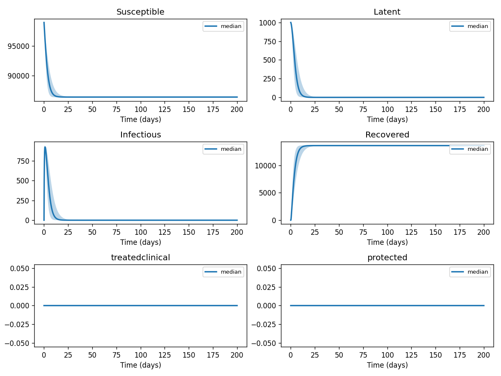
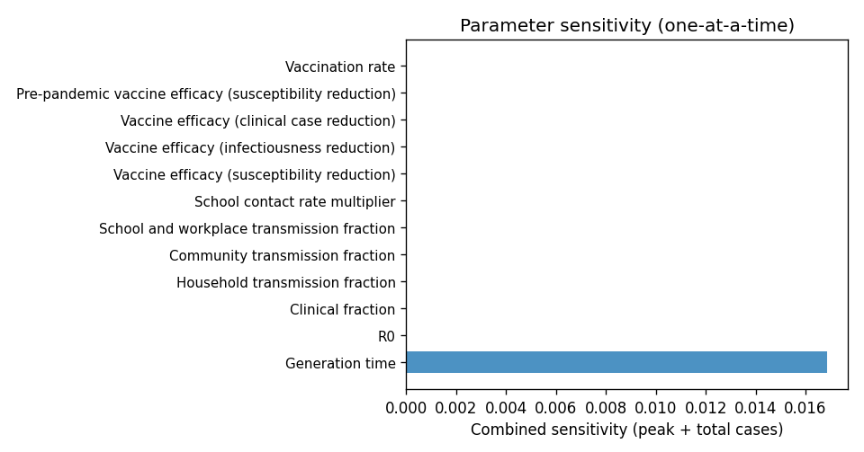

# Phase 4 — Uncertainty quantification: Influenza2

This report summarizes parameter distributions (general framework), Monte Carlo simulation, and sensitivity analysis.

## Source model provenance

| Field | Value |
|-------|-------|
| Phase 3 fill mode | rag_only |
| Phase 3 run dir | `influenza2_gemini_phase3` |

---

## 1. Parameter distributions (Task 9.1)

Distributions are assigned using the **general framework** (typed parameter uncertainty): same distribution families and typical ranges for similar parameter types across diseases.

| Parameter | Type | Family | Low | High | Point |
|-----------|------|--------|-----|------|-------|
| R0 | other | uniform | 1.4 | 2.0 | 1.7 |
| Generation time | transmission | lognormal | 1.400801052937908 | 4.427348801157865 | 2.6 |
| Clinical fraction | other | uniform | 0.25 | 0.75 | 0.5 |
| Household transmission fraction | transmission | lognormal | 0.1616308907236047 | 0.5108479385951381 | 0.3 |
| Community transmission fraction | transmission | lognormal | 0.17779397979596526 | 0.5619327324546519 | 0.33 |
| School and workplace transmission fraction | transmission | lognormal | 0.1993447652257792 | 0.6300457909340038 | 0.37 |
| School contact rate multiplier | transmission | lognormal | 1.0775392714906984 | 3.4056529239675877 | 2.0 |
| Vaccine efficacy (susceptibility reduction) | other | uniform | 0.35 | 1.0499999999999998 | 0.7 |
| Vaccine efficacy (infectiousness reduction) | other | uniform | 0.15 | 0.44999999999999996 | 0.3 |
| Vaccine efficacy (clinical case reduction) | other | uniform | 0.25 | 0.75 | 0.5 |
| Pre-pandemic vaccine efficacy (susceptibility reduction) | other | uniform | 0.15 | 0.44999999999999996 | 0.3 |
| Vaccination rate | other | uniform | 0.005 | 0.015 | 0.01 |
| Vaccine protection delay | other | uniform | 7.0 | 21.0 | 14.0 |
| US population size | other | uniform | 150000000.0 | 450000000.0 | 300000000.0 |
| GB population size | other | uniform | 29050000.0 | 87150000.0 | 58100000.0 |
| Household quarantine compliance | other | uniform | 0.25 | 0.75 | 0.5 |
| Household quarantine external contact reduction | transmission | lognormal | 0.40407722680901187 | 1.2771198464878455 | 0.75 |
| Household quarantine internal contact increase | transmission | lognormal | 0.5387696357453492 | 1.702826461983794 | 1.0 |
| Quarantine duration | recovery | lognormal | 8.382552745312724 | 22.006492990866604 | 14.0 |
| clinicaltransmissionrate | transmission | lognormal | 0.24244633608540714 | 0.7662719078927073 | 0.45 |
| subclinicaltransmissionrate | transmission | lognormal | 0.1185293198639768 | 0.37462182163643465 | 0.22 |
| clinicalprogressionrate | progression | lognormal | 0.2047324615832327 | 0.6470740555538417 | 0.38 |
| subclinicalprogressionrate | progression | lognormal | 0.2047324615832327 | 0.6470740555538417 | 0.38 |
| treatmentrate | other | uniform | 0.5 | 1.5 | 1.0 |
| clinicalrecoveryrate | recovery | lognormal | 0.19758874328237142 | 0.5187244776418556 | 0.33 |
| … | … | … | … | … | … (*29 total*) |

## 2. Monte Carlo simulation (Task 9.2)

- **Samples:** 1000   **Days:** 200   **Compartments:** Susceptible, Latent, Infectious, Recovered, treatedclinical, protected

**Peak value spread (5th / 50th / 95th percentile across ensemble):**

| Compartment | P5 peak | P50 peak | P95 peak |
|-------------|---------|----------|----------|
| Susceptible | — | — | — |
| Latent | — | — | — |
| Infectious | — | — | — |
| Recovered | — | — | — |
| treatedclinical | — | — | — |
| protected | — | — | — |

## 3. Sensitivity analysis (Task 9.3)

**Parameter ranking by combined impact on peak infections + total cases:**

| Rank | Parameter | Peak impact | Total cases impact | Combined |
|------|-----------|------------|-------------------|---------|
| 1 | Generation time | 0.0000 | 0.0000 | 0.0169 |
| 2 | R0 | 0.0000 | 0.0000 | 0.0000 |
| 3 | Clinical fraction | 0.0000 | 0.0000 | 0.0000 |
| 4 | Household transmission fraction | 0.0000 | 0.0000 | 0.0000 |
| 5 | Community transmission fraction | 0.0000 | 0.0000 | 0.0000 |
| 6 | School and workplace transmission fraction | 0.0000 | 0.0000 | 0.0000 |
| 7 | School contact rate multiplier | 0.0000 | 0.0000 | 0.0000 |
| 8 | Vaccine efficacy (susceptibility reduction) | 0.0000 | 0.0000 | 0.0000 |
| 9 | Vaccine efficacy (infectiousness reduction) | 0.0000 | 0.0000 | 0.0000 |
| 10 | Vaccine efficacy (clinical case reduction) | 0.0000 | 0.0000 | 0.0000 |

---
*Generated by Phase 4 (uncertainty quantification). Model: `influenza2`. General framework: `phase 4/data/general_framework.json`.*