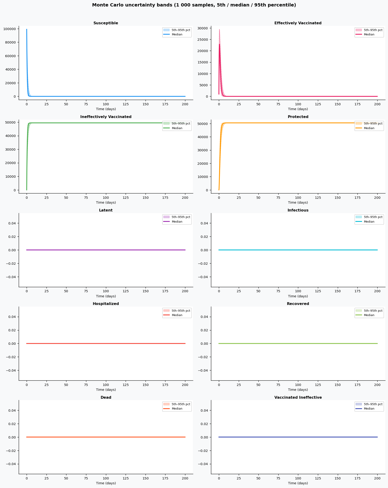

# Phase 4 — Uncertainty quantification: Influenza3

This report summarizes parameter distributions (general framework), Monte Carlo simulation, and sensitivity analysis.

## Source model provenance

| Field | Value |
|-------|-------|
| Phase 3 fill mode | retrieval_only |
| Phase 3 run dir | `influenza3_gemini_phase3` |

---

## 1. Parameter distributions (Task 9.1)

Distributions are assigned using the **general framework** (typed parameter uncertainty): same distribution families and typical ranges for similar parameter types across diseases.

| Parameter | Type | Family | Low | High | Point |
|-----------|------|--------|-----|------|-------|
| kappa | progression | lognormal | 0.5387696357453492 | 1.702826461983794 | 1.0 |
| gamma_1 | recovery | lognormal | 0.5987537675223377 | 1.5718923564904717 | 1.0 |
| gamma_2 | recovery | lognormal | 0.5987537675223377 | 1.5718923564904717 | 1.0 |
| alpha_i | other | uniform | 0.5 | 1.5 | 1.0 |
| delta_i | mortality | lognormal | 0.436351915275356 | 1.9756277796402941 | 1.0 |
| q | transmission | lognormal | 0.0 | 0.0 | 0.0 |
| beta_ij | transmission | lognormal | 0.01 | 1.0 | 0.505 |
| R0 | other | uniform | 1.4 | 1.8 | 1.6 |
| e_i | other | uniform | 0.3875 | 1.1625 | 0.775 |
| gamma | recovery | lognormal | 0.5987537675223377 | 1.5718923564904717 | 1.0 |
| nu(t) | other | uniform | 2.5 | 7.5 | 5.0 |
| vaccination_coverage | other | uniform | 5.0 | 20.0 | 12.5 |
| t* | other | uniform | 12.5 | 37.5 | 25.0 |
| communitytransmissionrate | transmission | lognormal | 0.24244633608540714 | 0.7662719078927073 | 0.45 |
| hospitaltransmissionrate | transmission | lognormal | 0.10775392714906984 | 0.3405652923967588 | 0.2 |
| effectivevaccinationrate | other | uniform | 0.015 | 0.045 | 0.03 |
| ineffectivevaccinationrate | other | uniform | 0.005 | 0.015 | 0.01 |
| protectiondelayrate | recovery | lognormal | 0.059875376752233776 | 0.15718923564904722 | 0.1 |
| latentprogressionrate | progression | lognormal | 0.2833928284020537 | 0.8956867190034757 | 0.526 |
| hospitalizationrate | other | uniform | 0.1 | 0.30000000000000004 | 0.2 |
| communityrecoveryrate | recovery | lognormal | 0.11975075350446751 | 0.3143784712980943 | 0.2 |
| hospitalrecoveryrate | recovery | lognormal | 0.14968844188058442 | 0.39297308912261786 | 0.25 |
| hospitalmortalityrate | mortality | lognormal | 0.006545278729130341 | 0.029634416694604402 | 0.015 |

## 2. Monte Carlo simulation (Task 9.2)

- **Samples:** 1000   **Days:** 200   **Compartments:** Susceptible, Effectively Vaccinated, Ineffectively Vaccinated, Protected, Latent, Infectious, Hospitalized, Recovered, Dead, vaccinatedineffective

**Peak value spread (5th / 50th / 95th percentile across ensemble):**

| Compartment | P5 peak | P50 peak | P95 peak |
|-------------|---------|----------|----------|
| Susceptible | — | — | — |
| Effectively Vaccinated | — | — | — |
| Ineffectively Vaccinated | — | — | — |
| Protected | — | — | — |
| Latent | — | — | — |
| Infectious | — | — | — |
| Hospitalized | — | — | — |
| Recovered | — | — | — |
| Dead | — | — | — |
| vaccinatedineffective | — | — | — |

## 3. Sensitivity analysis (Task 9.3)

**Parameter ranking by combined impact on peak infections + total cases:**

| Rank | Parameter | Peak impact | Total cases impact | Combined |
|------|-----------|------------|-------------------|---------|
| 1 | kappa | 0.0000 | 0.0000 | 0.0000 |
| 2 | gamma_1 | 0.0000 | 0.0000 | 0.0000 |
| 3 | gamma_2 | 0.0000 | 0.0000 | 0.0000 |
| 4 | alpha_i | 0.0000 | 0.0000 | 0.0000 |
| 5 | delta_i | 0.0000 | 0.0000 | 0.0000 |
| 6 | q | 0.0000 | 0.0000 | 0.0000 |
| 7 | beta_ij | 0.0000 | 0.0000 | 0.0000 |
| 8 | R0 | 0.0000 | 0.0000 | 0.0000 |
| 9 | e_i | 0.0000 | 0.0000 | 0.0000 |
| 10 | gamma | 0.0000 | 0.0000 | 0.0000 |

---
*Generated by Phase 4 (uncertainty quantification). Model: `influenza3`. General framework: `phase 4/data/general_framework.json`.*