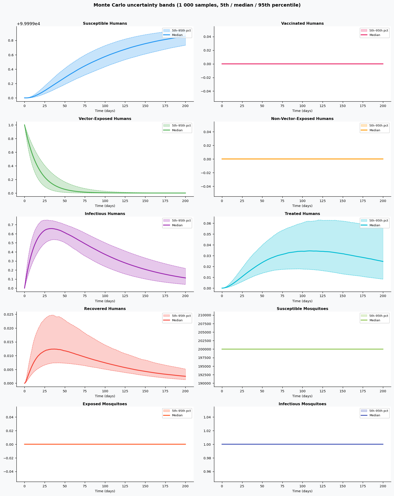
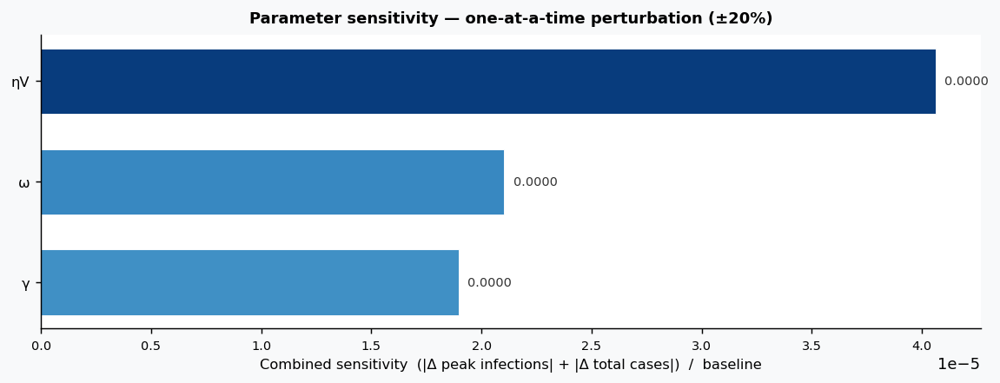

# Phase 4 — Uncertainty quantification: Malaria1

This report summarizes parameter distributions (general framework), Monte Carlo simulation, and sensitivity analysis.

## Source model provenance

| Field | Value |
|-------|-------|
| Phase 3 fill mode | retrieval_only |
| Phase 3 run dir | `malaria1_gemini_phase3` |

---

## 1. Parameter distributions (Task 9.1)

Distributions are assigned using the **general framework** (typed parameter uncertainty): same distribution families and typical ranges for similar parameter types across diseases.

| Parameter | Type | Family | Low | High | Point | Note |
|-----------|------|--------|-----|------|-------|------|
| π | other | uniform | 0.006 | 0.018 | 0.012 |  |
| k | other | uniform | 0.3 | 0.9 | 0.6 |  |
| µ1 | mortality | lognormal | 8.727e-05 | 0.0003951 | 0.0002 |  |
| µ2 | mortality | lognormal | 0.04364 | 0.1976 | 0.1 |  |
| θ | mortality | lognormal | 0.04364 | 0.1976 | 0.1 |  |
| ε | other | uniform | 0.15 | 0.45 | 0.3 |  |
| ηV | transmission | lognormal | 0.0005388 | 0.001703 | 0.001 |  |
| ηS | transmission | lognormal | 0.002694 | 0.008514 | 0.005 |  |
| ξV | transmission | lognormal | 0.0002694 | 0.0008514 | 0.0005 |  |
| ξS | transmission | lognormal | 0.0005388 | 0.001703 | 0.001 |  |
| τ1 | progression | lognormal | 0.02694 | 0.08514 | 0.05 |  |
| τ2 | progression | lognormal | 0.02694 | 0.08514 | 0.05 |  |
| δ1 | mortality | lognormal | 0.0008727 | 0.003951 | 0.002 |  |
| σ | progression | lognormal | 0.05388 | 0.1703 | 0.1 |  |
| ω | progression | lognormal | 0.02694 | 0.08514 | 0.05 |  |
| γ | recovery | lognormal | 0.005988 | 0.01572 | 0.01 |  |
| ρ | transmission | lognormal | 0.005388 | 0.01703 | 0.01 |  |
| φ | progression | lognormal | 0.1 | 1 | 0.55 | † |
| β1 | transmission | lognormal | 0.05 | 1 | 0.525 | † |
| β2 | transmission | lognormal | 0.05 | 1 | 0.525 | † |
| α1 | transmission | lognormal | 0.05 | 1 | 0.525 | † |
| α2 | transmission | lognormal | 0.05 | 1 | 0.525 | † |
| β3 | transmission | lognormal | 0.05 | 1 | 0.525 | † |
| μ1 | mortality | lognormal | 0.007854 | 0.03556 | 0.018 |  |
| λv^v | transmission | lognormal | 0.2694 | 0.8514 | 0.5 |  |
| … | … | … | … | … | … | (*30 total*) |

† Range inferred from parameter type — no value recovered from paper text.

## 2. Monte Carlo simulation (Task 9.2)

- **Samples:** 1000   **Days:** 200   **Compartments:** Susceptible Humans, Vaccinated Humans, Vector-Exposed Humans, Non-Vector-Exposed Humans, Infectious Humans, Treated Humans, Recovered Humans, Susceptible Mosquitoes, Exposed Mosquitoes, Infectious Mosquitoes

**Peak value spread (5th / 50th / 95th percentile across ensemble):**

| Compartment | P5 peak | P50 peak | P95 peak |
|-------------|---------|----------|----------|
| Susceptible Humans | 99999.73 | 99999.86 | 99999.95 |
| Vaccinated Humans | 0.00 | 0.00 | 0.00 |
| Vector-Exposed Humans | 1.00 | 1.00 | 1.00 |
| Non-Vector-Exposed Humans | 0.00 | 0.00 | 0.00 |
| Infectious Humans | 0.54 | 0.66 | 0.75 |
| Treated Humans | 0.02 | 0.03 | 0.06 |
| Recovered Humans | 0.01 | 0.01 | 0.02 |
| Susceptible Mosquitoes | 199999.00 | 199999.00 | 199999.00 |
| Exposed Mosquitoes | 0.00 | 0.00 | 0.00 |
| Infectious Mosquitoes | 1.00 | 1.00 | 1.00 |

## 3. Sensitivity analysis (Task 9.3)

**Parameter ranking by combined impact on peak infections + total cases:**

| Rank | Parameter | Peak impact | Total cases impact | Combined |
|------|-----------|------------|-------------------|---------|
| 1 | ηV | 0.0000 | 0.0000 | 0.0000 |
| 2 | ω | -0.0000 | -0.0000 | 0.0000 |
| 3 | γ | -0.0000 | -0.0000 | 0.0000 |
| 4 | k | 0.0000 | -0.0000 | 0.0000 |
| 5 | π | 0.0000 | 0.0000 | 0.0000 |
| 6 | µ1 | 0.0000 | 0.0000 | 0.0000 |
| 7 | µ2 | 0.0000 | 0.0000 | 0.0000 |
| 8 | θ | 0.0000 | 0.0000 | 0.0000 |
| 9 | ε | 0.0000 | 0.0000 | 0.0000 |
| 10 | ηS | 0.0000 | 0.0000 | 0.0000 |

---
*Generated by Phase 4 (uncertainty quantification). Model: `malaria1`. General framework: `phase 4/data/general_framework.json`.*