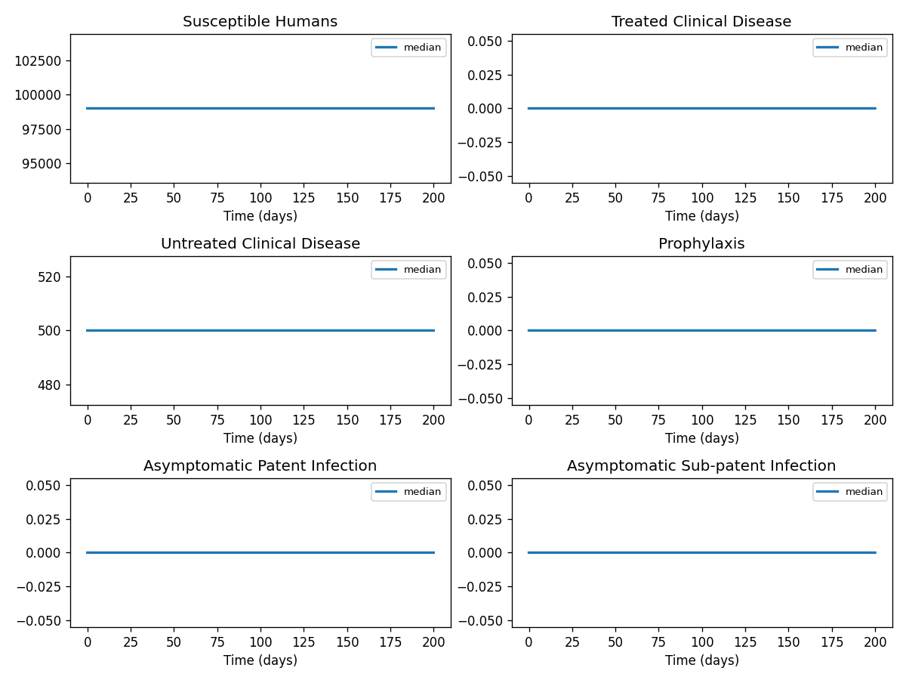
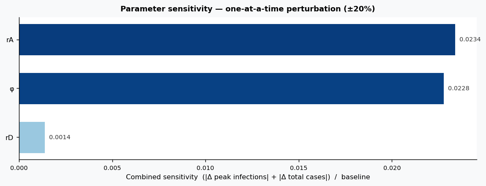

# Phase 4 — Uncertainty quantification: Malaria2

This report summarizes parameter distributions (general framework), Monte Carlo simulation, and sensitivity analysis.

## Source model provenance

| Field | Value |
|-------|-------|
| Phase 3 fill mode | retrieval_only |
| Phase 3 run dir | `malaria2_gemini_phase3` |

---

## 1. Parameter distributions (Task 9.1)

Distributions are assigned using the **general framework** (typed parameter uncertainty): same distribution families and typical ranges for similar parameter types across diseases.

| Parameter | Type | Family | Low | High | Point |
|-----------|------|--------|-----|------|-------|
| φ | mortality | lognormal | 0.0 | 0.0 | 0.0 |
| fT | other | uniform | 0.0 | 0.0 | 0.0 |
| rT | other | uniform | 0.0 | 0.0 | 0.0 |
| rP | other | uniform | 0.0 | 0.0 | 0.0 |
| rD | other | uniform | 0.0 | 0.0 | 0.0 |
| rA | mortality | lognormal | 0.0 | 0.0 | 0.0 |
| rU | other | uniform | 0.0 | 0.0 | 0.0 |
| Λ | transmission | lognormal | 0.0 | 0.0 | 0.0 |
| EIR | other | uniform | 3.0 | 675.0 | 339.0 |
| HBI | other | uniform | 0.0 | 0.0 | 0.0 |
| LLIN_half_life | other | uniform | 1.32 | 3.96 | 2.64 |
| LLIN_adherence_decay | other | uniform | 0.1 | 0.30000000000000004 | 0.2 |
| DDT_half_life | other | uniform | 3.0 | 9.0 | 6.0 |
| ACT_prophylaxis_duration | recovery | lognormal | 14.968844188058437 | 39.29730891226179 | 25.0 |
| vaccine_efficacy | other | uniform | 0.25 | 0.75 | 0.5 |
| vaccine_half_life | other | uniform | 1.5 | 4.5 | 3.0 |
| LLIN_coverage | other | uniform | 0.4 | 1.2000000000000002 | 0.8 |
| IRS_coverage | other | uniform | 0.4 | 1.2000000000000002 | 0.8 |
| MSAT_coverage | other | uniform | 0.4 | 1.2000000000000002 | 0.8 |
| vaccine_coverage | other | uniform | 0.45 | 1.35 | 0.9 |

## 2. Monte Carlo simulation (Task 9.2)

- **Samples:** 1000   **Days:** 200   **Compartments:** Susceptible Humans, Treated Clinical Disease, Untreated Clinical Disease, Prophylaxis, Asymptomatic Patent Infection, Asymptomatic Sub-patent Infection, Susceptible Mosquitoes, Latent Mosquitoes, Infectious Mosquitoes

**Peak value spread (5th / 50th / 95th percentile across ensemble):**

| Compartment | P5 peak | P50 peak | P95 peak |
|-------------|---------|----------|----------|
| Susceptible Humans | — | — | — |
| Treated Clinical Disease | — | — | — |
| Untreated Clinical Disease | — | — | — |
| Prophylaxis | — | — | — |
| Asymptomatic Patent Infection | — | — | — |
| Asymptomatic Sub-patent Infection | — | — | — |
| Susceptible Mosquitoes | — | — | — |
| Latent Mosquitoes | — | — | — |
| Infectious Mosquitoes | — | — | — |

## 3. Sensitivity analysis (Task 9.3)

**Parameter ranking by combined impact on peak infections + total cases:**

| Rank | Parameter | Peak impact | Total cases impact | Combined |
|------|-----------|------------|-------------------|---------|
| 1 | rD | 0.0000 | 0.0000 | 1.0000 |
| 2 | φ | 0.0000 | 0.0000 | 0.0038 |
| 3 | fT | 0.0000 | 0.0000 | 0.0000 |
| 4 | rT | 0.0000 | 0.0000 | 0.0000 |
| 5 | rP | 0.0000 | 0.0000 | 0.0000 |
| 6 | rA | 0.0000 | 0.0000 | 0.0000 |
| 7 | rU | 0.0000 | 0.0000 | 0.0000 |
| 8 | Λ | 0.0000 | 0.0000 | 0.0000 |
| 9 | EIR | 0.0000 | 0.0000 | 0.0000 |
| 10 | HBI | 0.0000 | 0.0000 | 0.0000 |

---
*Generated by Phase 4 (uncertainty quantification). Model: `malaria2`. General framework: `phase 4/data/general_framework.json`.*