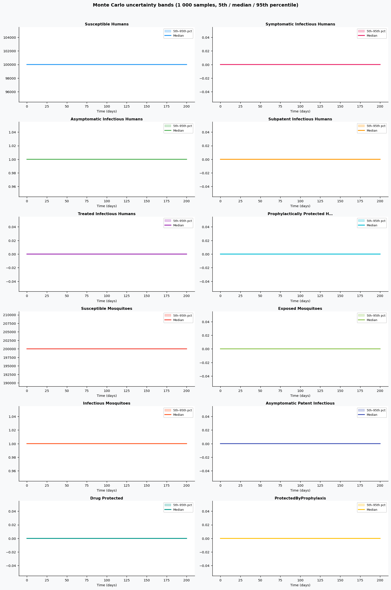

# Phase 4 — Uncertainty quantification: Malaria3

This report summarizes parameter distributions (general framework), Monte Carlo simulation, and sensitivity analysis.

## Source model provenance

| Field | Value |
|-------|-------|
| Phase 3 fill mode | llm_only |
| Phase 3 run dir | `malaria3_gemini_phase3` |

---

## 1. Parameter distributions (Task 9.1)

Distributions are assigned using the **general framework** (typed parameter uncertainty): same distribution families and typical ranges for similar parameter types across diseases.

| Parameter | Type | Family | Low | High | Point | Note |
|-----------|------|--------|-----|------|-------|------|
| Drug efficacy (ACT) | other | uniform | 47.5 | 142.5 | 95 |  |
| Duration of gametocytaemia after non-artemisinin treatment | recovery | lognormal | 33.29 | 87.4 | 55.6 |  |
| Duration of gametocytaemia after ACT treatment | recovery | lognormal | 8.023 | 21.06 | 13.4 |  |
| Duration of gametocytaemia after ACT-PQ treatment | recovery | lognormal | 1.796 | 4.716 | 3 |  |
| Duration of prophylaxis (short-acting drug) | recovery | lognormal | 5.988 | 15.72 | 10 |  |
| Duration of prophylaxis (long-acting drug) | recovery | lognormal | 17.96 | 47.16 | 30 |  |
| Reduction in infectiousness after non-artemisinin treatment | other | uniform | 35 | 105 | 70 |  |
| Reduction in infectiousness after ACT/ACT-PQ treatment | other | uniform | 40.3 | 120.9 | 80.6 |  |
| Pregnancy prevalence in population aged 15-45 | other | uniform | 3.55 | 10.65 | 7.1 |  |
| Correlation in participation between MDA rounds | other | uniform | 0.25 | 0.75 | 0.5 |  |
| MDA coverage | other | uniform | 40 | 120 | 80 |  |
| ACT coverage for symptomatic treatment | other | uniform | 10 | 30 | 20 |  |
| Non-ACT treatment efficacy | other | uniform | 30 | 90 | 60 |  |
| ACT treatment efficacy | other | uniform | 47.5 | 142.5 | 95 |  |
| Relative infectivity of asymptomatic vs symptomatic | transmission | lognormal | 0.1778 | 0.5619 | 0.33 |  |
| Relative infectivity of subpatent vs symptomatic | other | uniform | 0.03 | 0.09 | 0.06 |  |
| susceptibletosymptomaticinfectionrate | other | uniform | 0.0025 | 0.0075 | 0.005 |  |
| susceptibletoasymptomaticinfectionrate | other | uniform | 0.0025 | 0.0075 | 0.005 |  |
| treatmentrate | other | uniform | 0.05 | 0.15 | 0.1 |  |
| symptomatictoasymptomaticrate | other | uniform | 0.05 | 0.15 | 0.1 |  |
| superinfectiontosymptomaticrate | other | uniform | 0.1 | 0.3 | 0.2 |  |
| superinfectiontoasymptomaticrate | other | uniform | 0.025 | 0.075 | 0.05 |  |
| patenttosubpatentrate | other | uniform | 0.05 | 0.15 | 0.1 |  |
| subpatentclearancerate | other | uniform | 0.75 | 2.25 | 1.5 |  |
| treatmentrecoverytoprotectionrate | recovery | lognormal | 0.02994 | 0.07859 | 0.05 |  |
| … | … | … | … | … | … | (*32 total*) |

## 2. Monte Carlo simulation (Task 9.2)

- **Samples:** 1000   **Days:** 200   **Compartments:** Susceptible Humans, Symptomatic Infectious Humans, Asymptomatic Infectious Humans, Subpatent Infectious Humans, Treated Infectious Humans, Prophylactically Protected Humans, Susceptible Mosquitoes, Exposed Mosquitoes, Infectious Mosquitoes, Asymptomatic Patent Infectious, Drug Protected, ProtectedByProphylaxis

**Peak value spread (5th / 50th / 95th percentile across ensemble):**

| Compartment | P5 peak | P50 peak | P95 peak |
|-------------|---------|----------|----------|
| Susceptible Humans | 99999.00 | 99999.00 | 99999.00 |
| Symptomatic Infectious Humans | 0.00 | 0.00 | 0.00 |
| Asymptomatic Infectious Humans | 1.00 | 1.00 | 1.00 |
| Subpatent Infectious Humans | 0.00 | 0.00 | 0.00 |
| Treated Infectious Humans | 0.00 | 0.00 | 0.00 |
| Prophylactically Protected Humans | 0.00 | 0.00 | 0.00 |
| Susceptible Mosquitoes | 199999.00 | 199999.00 | 199999.00 |
| Exposed Mosquitoes | 0.00 | 0.00 | 0.00 |
| Infectious Mosquitoes | 1.00 | 1.00 | 1.00 |
| Asymptomatic Patent Infectious | 0.00 | 0.00 | 0.00 |

## 3. Sensitivity analysis (Task 9.3)

**Parameter ranking by combined impact on peak infections + total cases:**

| Rank | Parameter | Peak impact | Total cases impact | Combined |
|------|-----------|------------|-------------------|---------|
| 1 | Drug efficacy (ACT) | 0.0000 | 0.0000 | 0.0000 |
| 2 | Duration of gametocytaemia after non-artemisinin treatment | 0.0000 | 0.0000 | 0.0000 |
| 3 | Duration of gametocytaemia after ACT treatment | 0.0000 | 0.0000 | 0.0000 |
| 4 | Duration of gametocytaemia after ACT-PQ treatment | 0.0000 | 0.0000 | 0.0000 |
| 5 | Duration of prophylaxis (short-acting drug) | 0.0000 | 0.0000 | 0.0000 |
| 6 | Duration of prophylaxis (long-acting drug) | 0.0000 | 0.0000 | 0.0000 |
| 7 | Reduction in infectiousness after non-artemisinin treatment | 0.0000 | 0.0000 | 0.0000 |
| 8 | Reduction in infectiousness after ACT/ACT-PQ treatment | 0.0000 | 0.0000 | 0.0000 |
| 9 | Pregnancy prevalence in population aged 15-45 | 0.0000 | 0.0000 | 0.0000 |
| 10 | Correlation in participation between MDA rounds | 0.0000 | 0.0000 | 0.0000 |

---
*Generated by Phase 4 (uncertainty quantification). Model: `malaria3`. General framework: `phase 4/data/general_framework.json`.*