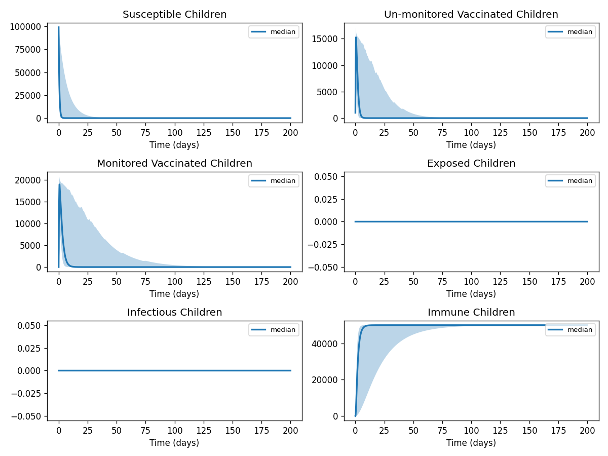

# Phase 4 — Uncertainty quantification: Measles1

This report summarizes parameter distributions (general framework), Monte Carlo simulation, and sensitivity analysis.

## Source model provenance

| Field | Value |
|-------|-------|
| Phase 3 fill mode | retrieval_only |
| Phase 3 run dir | `measles1_gemini_phase3` |

---

## 1. Parameter distributions (Task 9.1)

Distributions are assigned using the **general framework** (typed parameter uncertainty): same distribution families and typical ranges for similar parameter types across diseases.

| Parameter | Type | Family | Low | High | Point |
|-----------|------|--------|-----|------|-------|
| L | other | uniform | 0.0 | 1.0 | 0.5 |
| xU | other | uniform | 0.0435 | 0.1305 | 0.087 |
| xM | other | uniform | 2.385 | 7.154999999999999 | 4.77 |
| xA | other | uniform | 0.0 | 0.0 | 0.0 |
| bC | transmission | lognormal | 0.0010128869152012563 | 0.0032013137485295343 | 0.00188 |
| bA | transmission | lognormal | 0.5387696357453492 | 1.702826461983794 | 1.0 |
| m | mortality | lognormal | 0.436351915275356 | 1.9756277796402941 | 1.0 |
| g | recovery | lognormal | 0.5987537675223377 | 1.5718923564904717 | 1.0 |
| j | other | uniform | 0.5 | 1.5 | 1.0 |
| e | transmission | lognormal | 0.10775392714906984 | 0.3405652923967588 | 0.2 |
| hA | mortality | lognormal | 0.0 | 0.0 | 0.0 |
| hU | mortality | lognormal | 1.309055745826068 | 5.926883338920882 | 3.0 |
| hM | mortality | lognormal | 0.07287076985098445 | 0.32992983919992913 | 0.167 |
| d | progression | lognormal | 0.37713874502174444 | 1.1919785233886557 | 0.7 |
| q | other | uniform | 0.075 | 0.22499999999999998 | 0.15 |
| a | transmission | lognormal | 0.006750783535889225 | 0.021336415568656942 | 0.01253 |
| ξu | other | uniform | 0.00435 | 0.013049999999999999 | 0.0087 |
| φ | other | uniform | 0.00064 | 0.0019200000000000003 | 0.00128 |

## 2. Monte Carlo simulation (Task 9.2)

- **Samples:** 1000   **Days:** 200   **Compartments:** Susceptible Children, Un-monitored Vaccinated Children, Monitored Vaccinated Children, Exposed Children, Infectious Children, Immune Children, Susceptible Adults, Un-monitored Vaccinated Adults, Vaccinated Adults, Exposed Adults, Infectious Adults, Immune Adults

**Peak value spread (5th / 50th / 95th percentile across ensemble):**

| Compartment | P5 peak | P50 peak | P95 peak |
|-------------|---------|----------|----------|
| Susceptible Children | — | — | — |
| Un-monitored Vaccinated Children | — | — | — |
| Monitored Vaccinated Children | — | — | — |
| Exposed Children | — | — | — |
| Infectious Children | — | — | — |
| Immune Children | — | — | — |
| Susceptible Adults | — | — | — |
| Un-monitored Vaccinated Adults | — | — | — |
| Vaccinated Adults | — | — | — |
| Exposed Adults | — | — | — |

## 3. Sensitivity analysis (Task 9.3)

**Parameter ranking by combined impact on peak infections + total cases:**

| Rank | Parameter | Peak impact | Total cases impact | Combined |
|------|-----------|------------|-------------------|---------|
| 1 | L | 0.0000 | 0.0000 | 1.0000 |
| 2 | xU | 0.0000 | 0.0000 | 0.0000 |
| 3 | xM | 0.0000 | 0.0000 | 0.0000 |
| 4 | xA | 0.0000 | 0.0000 | 0.0000 |
| 5 | bC | 0.0000 | 0.0000 | 0.0000 |
| 6 | bA | 0.0000 | 0.0000 | 0.0000 |
| 7 | m | 0.0000 | 0.0000 | 0.0000 |
| 8 | g | 0.0000 | 0.0000 | 0.0000 |
| 9 | j | 0.0000 | 0.0000 | 0.0000 |
| 10 | e | 0.0000 | 0.0000 | 0.0000 |

---
*Generated by Phase 4 (uncertainty quantification). Model: `measles1`. General framework: `phase 4/data/general_framework.json`.*