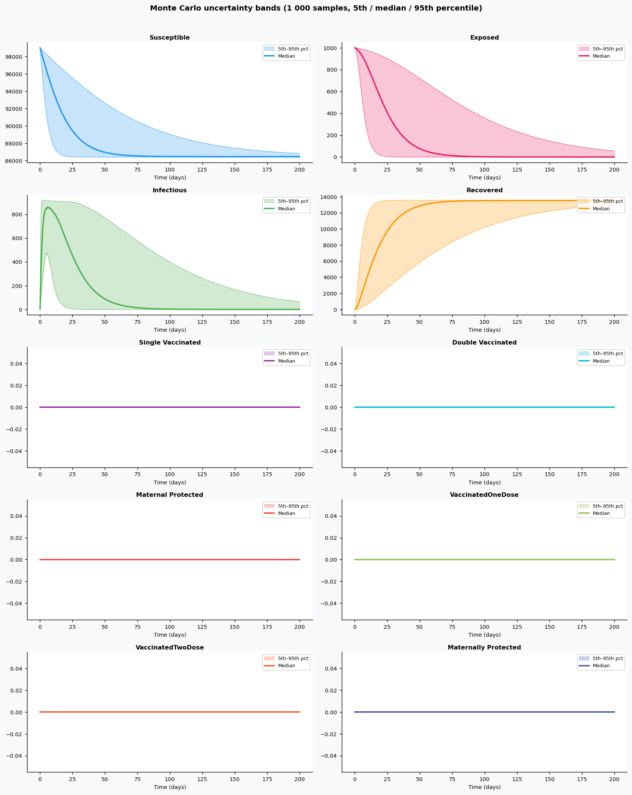
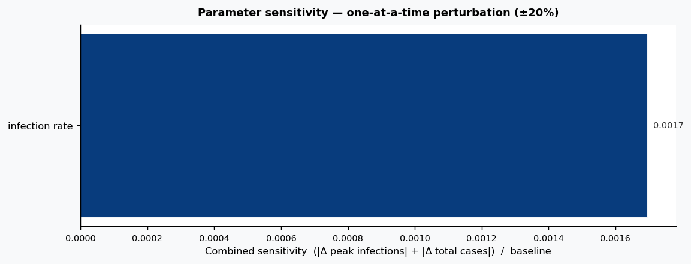

# Phase 4 — Uncertainty quantification: Measles2

This report summarizes parameter distributions (general framework), Monte Carlo simulation, and sensitivity analysis.

## Source model provenance

| Field | Value |
|-------|-------|
| Phase 3 fill mode | llm_only |
| Phase 3 run dir | `measles2_gemini_phase3` |

---

## 1. Parameter distributions (Task 9.1)

Distributions are assigned using the **general framework** (typed parameter uncertainty): same distribution families and typical ranges for similar parameter types across diseases.

| Parameter | Type | Family | Low | High | Point | Note |
|-----------|------|--------|-----|------|-------|------|
| infection rate | transmission | lognormal | 0.05 | 1 | 0.525 | † |
| duration of maternal immunity | recovery | lognormal | 0.05 | 0.5 | 0.275 | † |
| seasonality of transmission | transmission | lognormal | 0.05 | 1 | 0.525 | † |
| importation parameters | other | uniform | 0 | 1 | 0.5 | † |
| report rate of imported cases | other | uniform | 0 | 1 | 0.5 | † |
| vaccine effectiveness | other | uniform | 0 | 1 | 0.5 | † |
| existing immunity in older generations | mortality | lognormal | 1e-05 | 0.02 | 0.01001 | † |
| parameters of spatial spread | other | uniform | 0 | 1 | 0.5 | † |
| waning rate | mortality | lognormal | 1e-05 | 0.02 | 0.01001 | † |
| MMR1 coverage increase | other | uniform | 0.125 | 0.375 | 0.25 |  |
| MMR2 coverage increase | other | uniform | 1.5 | 4.5 | 3 |  |
| MMR2 schedule age | mortality | lognormal | 0.8727 | 3.951 | 2 |  |
| MMR2 school-entry age | other | uniform | 2.5 | 7.5 | 5 |  |
| current MMR2 schedule age | other | uniform | 1.5 | 4.5 | 3 |  |
| MMR1 schedule age | other | uniform | 0.5 | 1.5 | 1 |  |
| maternalimmunitylossrate | mortality | lognormal | 0.7636 | 3.457 | 1.75 |  |
| mmr1vaccinationrate | other | uniform | 0.46 | 1.38 | 0.92 |  |
| susceptibleinfectionrate | other | uniform | 0.15 | 0.45 | 0.3 |  |
| mmr2vaccinationrate | other | uniform | 0.44 | 1.32 | 0.88 |  |
| onedosebreakthroughrate | other | uniform | 0.035 | 0.105 | 0.07 |  |
| twodosebreakthroughrate | other | uniform | 0.005 | 0.015 | 0.01 |  |
| vaccinewaningrate | other | uniform | 0.0025 | 0.0075 | 0.005 |  |
| incubationprogressionrate | progression | lognormal | 0.04488 | 0.1418 | 0.0833 |  |
| recoveryrate | recovery | lognormal | 0.07484 | 0.1965 | 0.125 |  |

† Range inferred from parameter type — no value recovered from paper text.

## 2. Monte Carlo simulation (Task 9.2)

- **Samples:** 1000   **Days:** 200   **Compartments:** Susceptible, Exposed, Infectious, Recovered, Single Vaccinated, Double Vaccinated, Maternal Protected, VaccinatedOneDose, VaccinatedTwoDose, Maternally Protected

**Peak value spread (5th / 50th / 95th percentile across ensemble):**

| Compartment | P5 peak | P50 peak | P95 peak |
|-------------|---------|----------|----------|
| Susceptible | 99000.00 | 99000.00 | 99000.00 |
| Exposed | 1000.00 | 1000.00 | 1000.00 |
| Infectious | 475.17 | 860.12 | 919.11 |
| Recovered | 13034.79 | 13531.01 | 13570.75 |
| Single Vaccinated | 0.00 | 0.00 | 0.00 |
| Double Vaccinated | 0.00 | 0.00 | 0.00 |
| Maternal Protected | 0.00 | 0.00 | 0.00 |
| VaccinatedOneDose | 0.00 | 0.00 | 0.00 |
| VaccinatedTwoDose | 0.00 | 0.00 | 0.00 |
| Maternally Protected | 0.00 | 0.00 | 0.00 |

## 3. Sensitivity analysis (Task 9.3)

**Parameter ranking by combined impact on peak infections + total cases:**

| Rank | Parameter | Peak impact | Total cases impact | Combined |
|------|-----------|------------|-------------------|---------|
| 1 | infection rate | 0.0012 | 0.0005 | 0.0017 |
| 2 | duration of maternal immunity | 0.0000 | 0.0000 | 0.0000 |
| 3 | seasonality of transmission | 0.0000 | 0.0000 | 0.0000 |
| 4 | importation parameters | 0.0000 | 0.0000 | 0.0000 |
| 5 | report rate of imported cases | 0.0000 | 0.0000 | 0.0000 |
| 6 | vaccine effectiveness | 0.0000 | 0.0000 | 0.0000 |
| 7 | existing immunity in older generations | 0.0000 | 0.0000 | 0.0000 |
| 8 | parameters of spatial spread | 0.0000 | 0.0000 | 0.0000 |
| 9 | waning rate | 0.0000 | 0.0000 | 0.0000 |
| 10 | MMR1 coverage increase | 0.0000 | 0.0000 | 0.0000 |

---
*Generated by Phase 4 (uncertainty quantification). Model: `measles2`. General framework: `phase 4/data/general_framework.json`.*