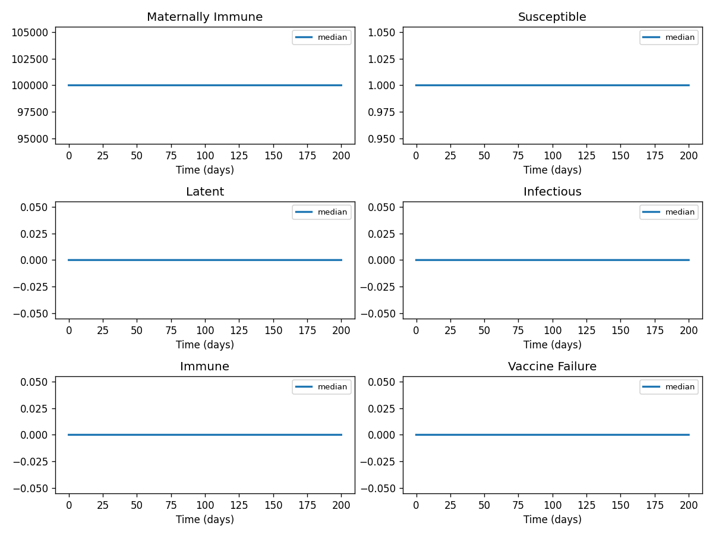

# Phase 4 — Uncertainty quantification: Measles3

This report summarizes parameter distributions (general framework), Monte Carlo simulation, and sensitivity analysis.

## Source model provenance

| Field | Value |
|-------|-------|
| Phase 3 fill mode | retrieval_only |
| Phase 3 run dir | `measles3_gemini_phase3` |

---

## 1. Parameter distributions (Task 9.1)

Distributions are assigned using the **general framework** (typed parameter uncertainty): same distribution families and typical ranges for similar parameter types across diseases.

| Parameter | Type | Family | Low | High | Point |
|-----------|------|--------|-----|------|-------|
| Force of infection | transmission | lognormal | 0.5387696357453492 | 1.702826461983794 | 1.0 |
| Rate of progression from latency | progression | lognormal | 28.09144880776251 | 88.78537172783501 | 52.14 |
| Rate of recovery from infection | recovery | lognormal | 31.219021438614686 | 81.95846746741321 | 52.14 |
| Rate of loss of passive immunity | recovery | lognormal | 23.950150700893502 | 62.875694259618854 | 40.0 |
| Vaccine efficacy | mortality | lognormal | 0.3927167237478204 | 1.7780650016762647 | 0.9 |
| Birth rate | other | uniform | 333333.0 | 999999.0 | 666666.0 |
| Background death rate | mortality | lognormal | 0.436351915275356 | 1.9756277796402941 | 1.0 |
| Contact rates | transmission | lognormal | 0.01 | 1.0 | 0.505 |
| maternalimmunitylossrate | recovery | lognormal | 0.0999918791762304 | 0.26250602353390873 | 0.167 |
| susceptibleinfectionrate | other | uniform | 0.4 | 1.2000000000000002 | 0.8 |
| effectivevaccinationrate | other | uniform | 0.015 | 0.045 | 0.03 |
| vaccinefailurerate | other | uniform | 0.01 | 0.03 | 0.02 |
| vaccinefailureinfectionrate | transmission | lognormal | 0.21550785429813968 | 0.6811305847935176 | 0.4 |
| latentprogressionrate | progression | lognormal | 0.2833928284020537 | 0.8956867190034757 | 0.526 |
| recoveryrate | recovery | lognormal | 0.08382552745312725 | 0.220064929908666 | 0.14 |

## 2. Monte Carlo simulation (Task 9.2)

- **Samples:** 1000   **Days:** 200   **Compartments:** Maternally Immune, Susceptible, Latent, Infectious, Immune, Vaccine Failure, maternalimmunity

**Peak value spread (5th / 50th / 95th percentile across ensemble):**

| Compartment | P5 peak | P50 peak | P95 peak |
|-------------|---------|----------|----------|
| Maternally Immune | — | — | — |
| Susceptible | — | — | — |
| Latent | — | — | — |
| Infectious | — | — | — |
| Immune | — | — | — |
| Vaccine Failure | — | — | — |
| maternalimmunity | — | — | — |

## 3. Sensitivity analysis (Task 9.3)

**Parameter ranking by combined impact on peak infections + total cases:**

| Rank | Parameter | Peak impact | Total cases impact | Combined |
|------|-----------|------------|-------------------|---------|
| 1 | Force of infection | 0.0000 | 0.0000 | 0.0000 |
| 2 | Rate of progression from latency | 0.0000 | 0.0000 | 0.0000 |
| 3 | Rate of recovery from infection | 0.0000 | 0.0000 | 0.0000 |
| 4 | Rate of loss of passive immunity | 0.0000 | 0.0000 | 0.0000 |
| 5 | Vaccine efficacy | 0.0000 | 0.0000 | 0.0000 |
| 6 | Birth rate | 0.0000 | 0.0000 | 0.0000 |
| 7 | Background death rate | 0.0000 | 0.0000 | 0.0000 |
| 8 | Contact rates | 0.0000 | 0.0000 | 0.0000 |
| 9 | maternalimmunitylossrate | 0.0000 | 0.0000 | 0.0000 |
| 10 | susceptibleinfectionrate | 0.0000 | 0.0000 | 0.0000 |

---
*Generated by Phase 4 (uncertainty quantification). Model: `measles3`. General framework: `phase 4/data/general_framework.json`.*