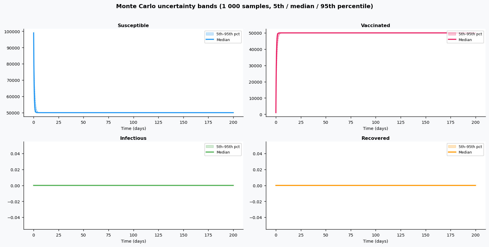

# Phase 4 — Uncertainty quantification: Tuberculosis1

This report summarizes parameter distributions (general framework), Monte Carlo simulation, and sensitivity analysis.

## Source model provenance

| Field | Value |
|-------|-------|
| Phase 3 fill mode | retrieval_only |
| Phase 3 run dir | `tuberculosis1_gemini_phase3` |

---

## 1. Parameter distributions (Task 9.1)

Distributions are assigned using the **general framework** (typed parameter uncertainty): same distribution families and typical ranges for similar parameter types across diseases.

| Parameter | Type | Family | Low | High | Point | Note |
|-----------|------|--------|-----|------|-------|------|
| A | other | uniform | 0.5 | 1.5 | 1 |  |
| β | transmission | lognormal | 0.01 | 5 | 2.505 |  |
| ϵ | other | uniform | 0 | 1 | 0.5 |  |
| u | other | uniform | 0 | 1 | 0.5 |  |
| θ | other | uniform | 0.067 | 0.1 | 0.0835 |  |
| γ | recovery | lognormal | 0.5 | 2 | 1.25 |  |
| δ | mortality | lognormal | 0.003 | 0.02 | 0.0115 |  |
| μ | mortality | lognormal | 0.4364 | 1.976 | 1 |  |
| π | other | uniform | 100 | 300 | 200 |  |

## 2. Monte Carlo simulation (Task 9.2)

- **Samples:** 1000   **Days:** 200   **Compartments:** Susceptible, Vaccinated, Infectious, Recovered

**Peak value spread (5th / 50th / 95th percentile across ensemble):**

| Compartment | P5 peak | P50 peak | P95 peak |
|-------------|---------|----------|----------|
| Susceptible | 99000.00 | 99000.00 | 99000.00 |
| Vaccinated | 50000.00 | 50000.00 | 50000.00 |
| Infectious | 0.00 | 0.00 | 0.00 |
| Recovered | 0.00 | 0.00 | 0.00 |

## 3. Sensitivity analysis (Task 9.3)

**Parameter ranking by combined impact on peak infections + total cases:**

| Rank | Parameter | Peak impact | Total cases impact | Combined |
|------|-----------|------------|-------------------|---------|
| 1 | A | 0.0000 | 0.0000 | 0.0000 |
| 2 | β | 0.0000 | 0.0000 | 0.0000 |
| 3 | ϵ | 0.0000 | 0.0000 | 0.0000 |
| 4 | u | 0.0000 | 0.0000 | 0.0000 |
| 5 | θ | 0.0000 | 0.0000 | 0.0000 |
| 6 | γ | 0.0000 | 0.0000 | 0.0000 |
| 7 | δ | 0.0000 | 0.0000 | 0.0000 |
| 8 | μ | 0.0000 | 0.0000 | 0.0000 |
| 9 | π | 0.0000 | 0.0000 | 0.0000 |

---
*Generated by Phase 4 (uncertainty quantification). Model: `tuberculosis1`. General framework: `phase 4/data/general_framework.json`.*