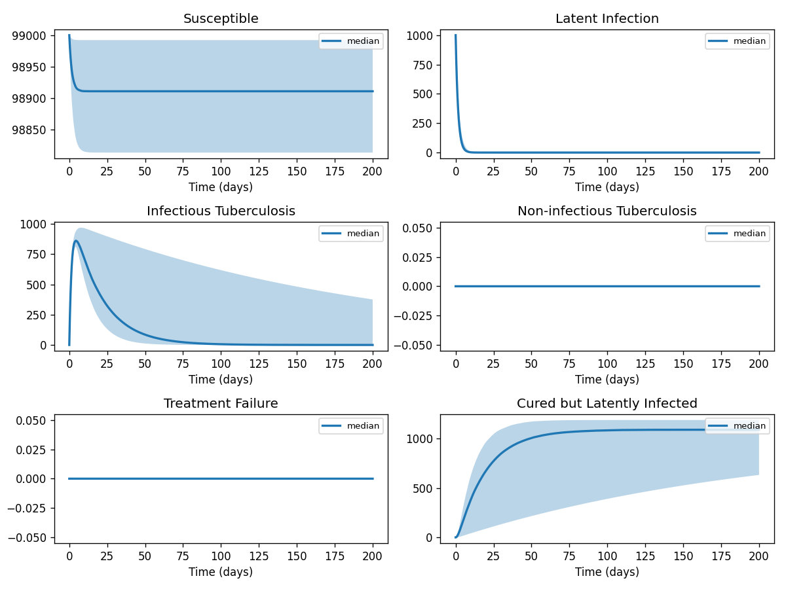
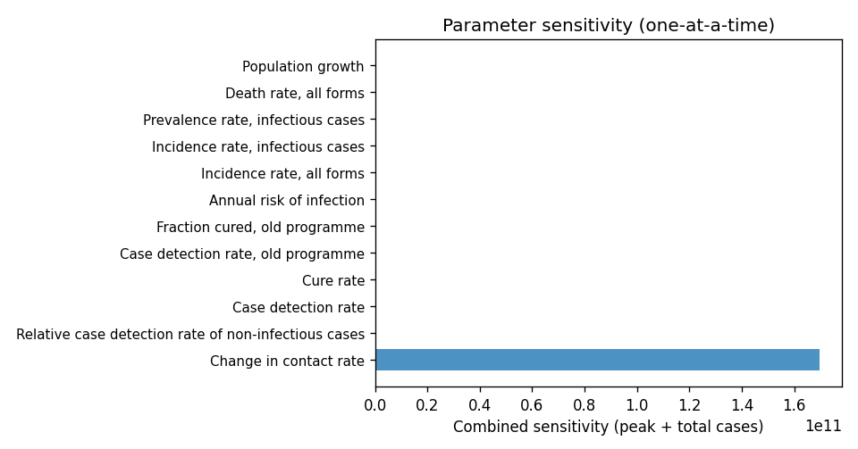

# Phase 4 — Uncertainty quantification: Tuberculosis2

This report summarizes parameter distributions (general framework), Monte Carlo simulation, and sensitivity analysis.

## Source model provenance

| Field | Value |
|-------|-------|
| Phase 3 fill mode | retrieval_only |
| Phase 3 run dir | `tuberculosis2_gemini_phase3` |

---

## 1. Parameter distributions (Task 9.1)

Distributions are assigned using the **general framework** (typed parameter uncertainty): same distribution families and typical ranges for similar parameter types across diseases.

| Parameter | Type | Family | Low | High | Point |
|-----------|------|--------|-----|------|-------|
| Case detection rate | other | uniform | 35.0 | 105.0 | 70.0 |
| Cure rate | other | uniform | 42.5 | 127.5 | 85.0 |
| Case detection rate, old programme | other | uniform | 25.0 | 75.0 | 50.0 |
| Fraction cured, old programme | other | uniform | 20.0 | 60.0 | 40.0 |
| Relative case detection rate of non-infectious cases | other | uniform | 0.5 | 0.8 | 0.65 |
| Annual risk of infection | other | uniform | 1.3 | 3.9000000000000004 | 2.6 |
| Incidence rate, all forms | other | uniform | 107.5 | 322.5 | 215.0 |
| Incidence rate, infectious cases | other | uniform | 53.0 | 159.0 | 106.0 |
| Prevalence rate, infectious cases | other | uniform | 100.5 | 301.5 | 201.0 |
| Death rate, all forms | mortality | lognormal | 40.144376205332755 | 181.75775572690713 | 92.0 |
| Population growth | other | uniform | 1.4 | 4.199999999999999 | 2.8 |
| Change in annual risk of infection | other | uniform | -0.44999999999999996 | -0.15 | -0.3 |
| Change in incidence rate | other | uniform | 1.35 | 4.050000000000001 | 2.7 |
| Change in death rate | mortality | lognormal | 1.2654205542985324 | 5.729320560956851 | 2.9 |
| Change in contact rate | transmission | uniform | 1e-10 | 0.1 | -0.7 |
| HIV-1 infection in tuberculosis cases, 2020 | other | uniform | 10.5 | 31.5 | 21.0 |
| primaryinfectiontolatentrate | other | uniform | 0.09 | 0.27 | 0.18 |
| primaryinfectiontoinfectiousrate | other | uniform | 0.0075 | 0.0225 | 0.015 |
| primaryinfectiontononinfectiousrate | other | uniform | 0.005 | 0.015 | 0.01 |
| latentreactivationtoinfectiousrate | other | uniform | 0.00125 | 0.00375 | 0.0025 |
| latentreactivationtononinfectiousrate | other | uniform | 0.00075 | 0.0022500000000000003 | 0.0015 |
| exogenousreinfectiontoinfectiousrate | progression | lognormal | 0.0032326178144720945 | 0.010216958771902769 | 0.006 |
| exogenousreinfectiontononinfectiousrate | progression | lognormal | 0.0021550785429813976 | 0.006811305847935183 | 0.004 |
| infectiouscasedetectionrate | other | uniform | 0.35 | 1.0499999999999998 | 0.7 |
| infectiousselfcurerate | other | uniform | 0.015 | 0.045 | 0.03 |
| … | … | … | … | … | … (*33 total*) |

## 2. Monte Carlo simulation (Task 9.2)

- **Samples:** 1000   **Days:** 200   **Compartments:** Susceptible, Latent Infection, Infectious Tuberculosis, Non-infectious Tuberculosis, Treatment Failure, Cured but Latently Infected, Self-cured, ontreatment

**Peak value spread (5th / 50th / 95th percentile across ensemble):**

| Compartment | P5 peak | P50 peak | P95 peak |
|-------------|---------|----------|----------|
| Susceptible | — | — | — |
| Latent Infection | — | — | — |
| Infectious Tuberculosis | — | — | — |
| Non-infectious Tuberculosis | — | — | — |
| Treatment Failure | — | — | — |
| Cured but Latently Infected | — | — | — |
| Self-cured | — | — | — |
| ontreatment | — | — | — |

## 3. Sensitivity analysis (Task 9.3)

**Parameter ranking by combined impact on peak infections + total cases:**

| Rank | Parameter | Peak impact | Total cases impact | Combined |
|------|-----------|------------|-------------------|---------|
| 1 | Change in contact rate | 0.0000 | 0.0000 | 169731136208.9073 |
| 2 | Relative case detection rate of non-infectious cases | 0.0000 | 0.0000 | 0.5277 |
| 3 | Case detection rate | 0.0000 | 0.0000 | 0.0000 |
| 4 | Cure rate | 0.0000 | 0.0000 | 0.0000 |
| 5 | Case detection rate, old programme | 0.0000 | 0.0000 | 0.0000 |
| 6 | Fraction cured, old programme | 0.0000 | 0.0000 | 0.0000 |
| 7 | Annual risk of infection | 0.0000 | 0.0000 | 0.0000 |
| 8 | Incidence rate, all forms | 0.0000 | 0.0000 | 0.0000 |
| 9 | Incidence rate, infectious cases | 0.0000 | 0.0000 | 0.0000 |
| 10 | Prevalence rate, infectious cases | 0.0000 | 0.0000 | 0.0000 |

---
*Generated by Phase 4 (uncertainty quantification). Model: `tuberculosis2`. General framework: `phase 4/data/general_framework.json`.*