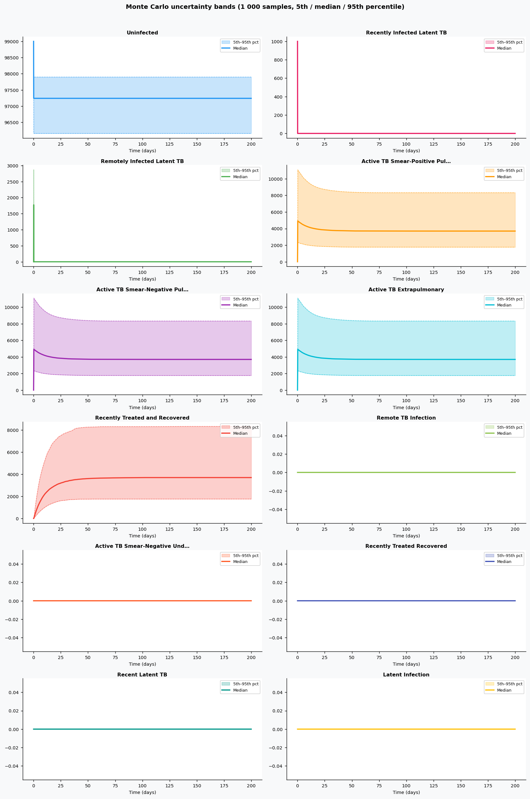
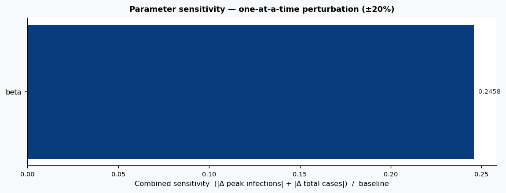

# Phase 4 — Uncertainty quantification: Tuberculosis3

This report summarizes parameter distributions (general framework), Monte Carlo simulation, and sensitivity analysis.

## Source model provenance

| Field | Value |
|-------|-------|
| Phase 3 fill mode | llm_only |
| Phase 3 run dir | `tuberculosis3_gemini_phase3` |

---

## 1. Parameter distributions (Task 9.1)

Distributions are assigned using the **general framework** (typed parameter uncertainty): same distribution families and typical ranges for similar parameter types across diseases.

| Parameter | Type | Family | Low | High | Point | Note |
|-----------|------|--------|-----|------|-------|------|
| beta | transmission | lognormal | 8.674 | 27.42 | 16.1 |  |
| relative_infectiousness_smear_negative | other | uniform | 0.11 | 0.33 | 0.22 |  |
| relative_rate_early_progression | progression | lognormal | 0.2694 | 0.8514 | 0.5 |  |
| rapid_progression_rate | progression | lognormal | 0.03771 | 0.1192 | 0.07 |  |
| slow_progression_rate | progression | lognormal | 0.0002694 | 0.0008514 | 0.0005 |  |
| proportion_extrapulmonary | other | uniform | 0.12 | 0.36 | 0.24 |  |
| proportion_smear_positive | other | uniform | 0.325 | 0.975 | 0.65 |  |
| mortality_rate_smear_positive | mortality | lognormal | 0.1004 | 0.4544 | 0.23 |  |
| mortality_rate_smear_negative_extrapulmonary | mortality | lognormal | 0.03054 | 0.1383 | 0.07 |  |
| natural_cure_rate_smear_positive | other | uniform | 0.05 | 0.15 | 0.1 |  |
| natural_cure_rate_smear_negative_extrapulmonary | other | uniform | 0.135 | 0.405 | 0.27 |  |
| informal_sector_size | other | uniform | 0.2275 | 0.6825 | 0.455 |  |
| treatment_success_notified_2008 | other | uniform | 0.375 | 1.125 | 0.75 |  |
| treatment_success_informal | other | uniform | 0.25 | 0.75 | 0.5 |  |
| relapse_rate | other | uniform | 0.012 | 0.036 | 0.024 |  |
| population_growth_rate | other | uniform | 0.015 | 0.045 | 0.03 |  |
| diagnostic_rate_smear_positive_2008 | other | uniform | 0.205 | 0.615 | 0.41 |  |
| diagnostic_rate_smear_negative_2008 | other | uniform | 0.08 | 0.24 | 0.16 |  |
| diagnostic_rate_extrapulmonary_2008 | other | uniform | 0.25 | 0.75 | 0.5 |  |
| infectionratefromsmearpositive | other | uniform | 5e-07 | 1.5e-06 | 1e-06 |  |
| infectionratefromsmearnegative | other | uniform | 0.075 | 0.225 | 0.15 |  |
| recenttoremotestabilizationrate | other | uniform | 0.25 | 0.75 | 0.5 |  |
| rapidprogressiontosmearpositiverate | progression | lognormal | 0.02694 | 0.08514 | 0.05 |  |
| rapidprogressiontosmearnegativerate | progression | lognormal | 3.233 | 10.22 | 6 |  |
| rapidprogressiontoextrapulmonaryrate | progression | lognormal | 0.02694 | 0.08514 | 0.05 |  |
| … | … | … | … | … | … | (*37 total*) |

## 2. Monte Carlo simulation (Task 9.2)

- **Samples:** 1000   **Days:** 200   **Compartments:** Uninfected, Recently Infected Latent TB, Remotely Infected Latent TB, Active TB Smear-Positive Pulmonary, Active TB Smear-Negative Pulmonary, Active TB Extrapulmonary, Recently Treated and Recovered, Remote TB Infection, Active TB Smear-Negative Undiagnosed, Recently Treated Recovered, Recent Latent TB, Latent Infection

**Peak value spread (5th / 50th / 95th percentile across ensemble):**

| Compartment | P5 peak | P50 peak | P95 peak |
|-------------|---------|----------|----------|
| Uninfected | 99000.00 | 99000.00 | 99000.00 |
| Recently Infected Latent TB | 1000.00 | 1000.00 | 1000.00 |
| Remotely Infected Latent TB | 1111.94 | 1776.86 | 2870.41 |
| Active TB Smear-Positive Pulmonary | 2346.52 | 4930.09 | 11101.16 |
| Active TB Smear-Negative Pulmonary | 2346.52 | 4930.09 | 11101.16 |
| Active TB Extrapulmonary | 2346.52 | 4930.09 | 11101.16 |
| Recently Treated and Recovered | 1761.25 | 3700.57 | 8332.24 |
| Remote TB Infection | 0.00 | 0.00 | 0.00 |
| Active TB Smear-Negative Undiagnosed | 0.00 | 0.00 | 0.00 |
| Recently Treated Recovered | 0.00 | 0.00 | 0.00 |

## 3. Sensitivity analysis (Task 9.3)

**Parameter ranking by combined impact on peak infections + total cases:**

| Rank | Parameter | Peak impact | Total cases impact | Combined |
|------|-----------|------------|-------------------|---------|
| 1 | beta | 0.0000 | 0.2458 | 0.2458 |
| 2 | relative_infectiousness_smear_negative | 0.0000 | 0.0000 | 0.0000 |
| 3 | relative_rate_early_progression | 0.0000 | 0.0000 | 0.0000 |
| 4 | rapid_progression_rate | 0.0000 | 0.0000 | 0.0000 |
| 5 | slow_progression_rate | 0.0000 | 0.0000 | 0.0000 |
| 6 | proportion_extrapulmonary | 0.0000 | 0.0000 | 0.0000 |
| 7 | proportion_smear_positive | 0.0000 | 0.0000 | 0.0000 |
| 8 | mortality_rate_smear_positive | 0.0000 | 0.0000 | 0.0000 |
| 9 | mortality_rate_smear_negative_extrapulmonary | 0.0000 | 0.0000 | 0.0000 |
| 10 | natural_cure_rate_smear_positive | 0.0000 | 0.0000 | 0.0000 |

---
*Generated by Phase 4 (uncertainty quantification). Model: `tuberculosis3`. General framework: `phase 4/data/general_framework.json`.*