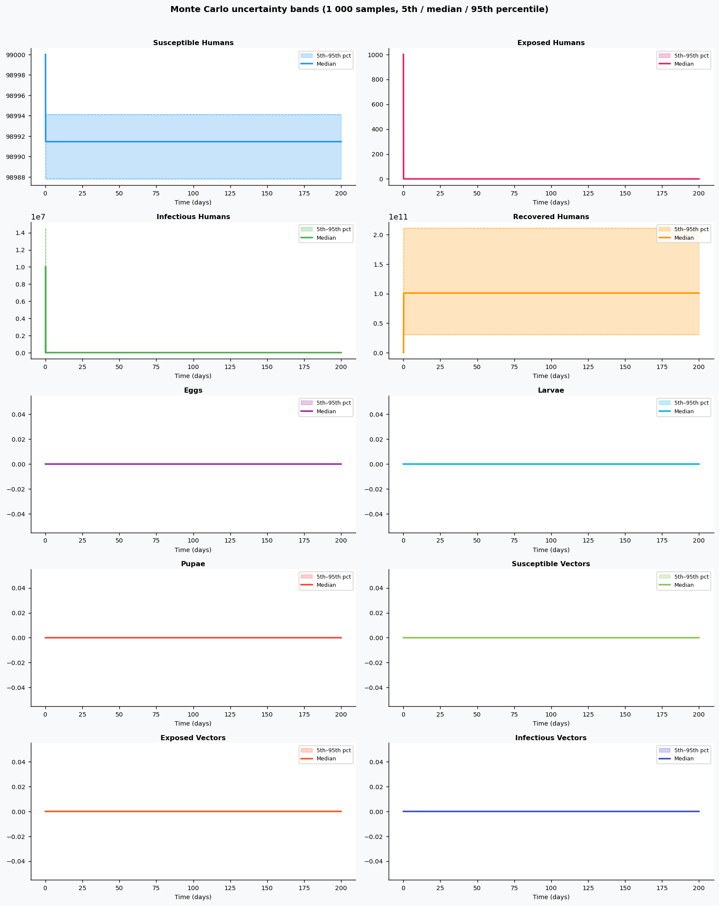
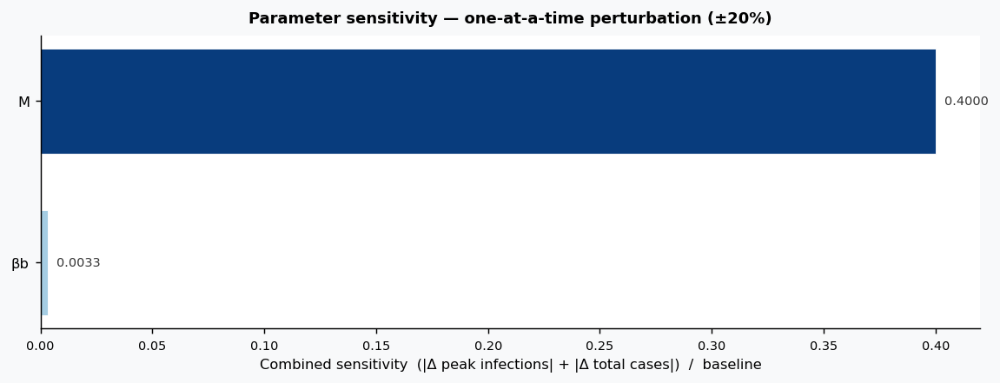

# Phase 4 — Uncertainty quantification: Zika1

This report summarizes parameter distributions (general framework), Monte Carlo simulation, and sensitivity analysis.

## Source model provenance

| Field | Value |
|-------|-------|
| Phase 3 fill mode | retrieval_only |
| Phase 3 run dir | `zika1_gemini_phase3` |

---

## 1. Parameter distributions (Task 9.1)

Distributions are assigned using the **general framework** (typed parameter uncertainty): same distribution families and typical ranges for similar parameter types across diseases.

| Parameter | Type | Family | Low | High | Point | Note |
|-----------|------|--------|-----|------|-------|------|
| βb | transmission | lognormal | 0.05 | 0.12 | 0.085 |  |
| 1/α_H | progression | lognormal | 2 | 4 | 3 |  |
| 1/α_V | progression | lognormal | 8 | 12 | 10 |  |
| 1/γ | recovery | lognormal | 5 | 7 | 6 |  |
| e_V | other | uniform | 40 | 120 | 80 |  |
| 1/τ1 | progression | lognormal | 1.616 | 5.108 | 3 |  |
| μ1 | mortality | lognormal | 0.02182 | 0.09878 | 0.05 |  |
| 1/τ2 | progression | lognormal | 4.849 | 15.33 | 9 |  |
| μ2 | mortality | lognormal | 0.01091 | 0.04939 | 0.025 |  |
| 1/τ3 | progression | lognormal | 1.616 | 5.108 | 3 |  |
| μ3 | mortality | lognormal | 0.001091 | 0.004939 | 0.0025 |  |
| μ_V | mortality | lognormal | 0.02182 | 0.09878 | 0.05 |  |
| q | other | uniform | 0.34 | 1.02 | 0.68 |  |
| K_H | other | uniform | 1.5e+07 | 4.5e+07 | 3e+07 |  |
| K_V | other | uniform | 5e+07 | 1.5e+08 | 1e+08 |  |
| κ | mortality | lognormal | 0.4364 | 1.976 | 1 |  |
| M | other | uniform | 5e+04 | 1.5e+05 | 1e+05 |  |
| λ | transmission | lognormal | 2.694e-05 | 8.514e-05 | 5e-05 |  |
| R0 | other | uniform | 0.5569 | 1.671 | 1.114 |  |
| 1/τ_h | progression | lognormal | 5388 | 1.703e+04 | 1e+04 |  |
| 1/τ_v | transmission | lognormal | 0.2694 | 0.8514 | 0.5 |  |
| r_h | other | uniform | 5000 | 1.5e+04 | 1e+04 |  |
| δ_l | transmission | lognormal | 0.2694 | 0.8514 | 0.5 |  |
| φ | transmission | lognormal | 0.2155 | 0.6811 | 0.4 |  |

## 2. Monte Carlo simulation (Task 9.2)

- **Samples:** 1000   **Days:** 200   **Compartments:** Susceptible Humans, Exposed Humans, Infectious Humans, Recovered Humans, Eggs, Larvae, Pupae, Susceptible Vectors, Exposed Vectors, Infectious Vectors

**Peak value spread (5th / 50th / 95th percentile across ensemble):**

| Compartment | P5 peak | P50 peak | P95 peak |
|-------------|---------|----------|----------|
| Susceptible Humans | 99000.00 | 99000.00 | 99000.00 |
| Exposed Humans | 1000.00 | 1000.00 | 1000.00 |
| Infectious Humans | 5519258.36 | 10051757.44 | 14533111.65 |
| Recovered Humans | 30462214228.52 | 101038015091.59 | 211211359953.37 |
| Eggs | 0.00 | 0.00 | 0.00 |
| Larvae | 0.00 | 0.00 | 0.00 |
| Pupae | 0.00 | 0.00 | 0.00 |
| Susceptible Vectors | 0.00 | 0.00 | 0.00 |
| Exposed Vectors | 0.00 | 0.00 | 0.00 |
| Infectious Vectors | 0.00 | 0.00 | 0.00 |

## 3. Sensitivity analysis (Task 9.3)

**Parameter ranking by combined impact on peak infections + total cases:**

| Rank | Parameter | Peak impact | Total cases impact | Combined |
|------|-----------|------------|-------------------|---------|
| 1 | M | 0.4000 | 0.0000 | 0.4000 |
| 2 | βb | 0.0000 | 0.0033 | 0.0033 |
| 3 | 1/α_H | 0.0000 | 0.0000 | 0.0000 |
| 4 | 1/α_V | 0.0000 | 0.0000 | 0.0000 |
| 5 | 1/γ | 0.0000 | 0.0000 | 0.0000 |
| 6 | e_V | 0.0000 | 0.0000 | 0.0000 |
| 7 | 1/τ1 | 0.0000 | 0.0000 | 0.0000 |
| 8 | μ1 | 0.0000 | 0.0000 | 0.0000 |
| 9 | 1/τ2 | 0.0000 | 0.0000 | 0.0000 |
| 10 | μ2 | 0.0000 | 0.0000 | 0.0000 |

---
*Generated by Phase 4 (uncertainty quantification). Model: `zika1`. General framework: `phase 4/data/general_framework.json`.*