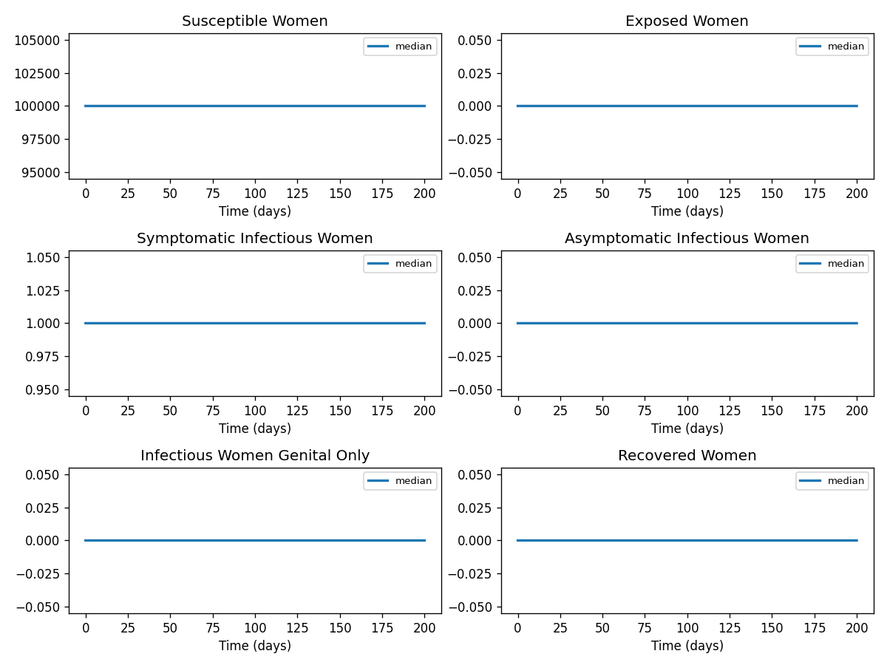

# Phase 4 — Uncertainty quantification: Zika2

This report summarizes parameter distributions (general framework), Monte Carlo simulation, and sensitivity analysis.

## Source model provenance

| Field | Value |
|-------|-------|
| Phase 3 fill mode | rag_only |
| Phase 3 run dir | `zika2_gemini_phase3` |

---

## 1. Parameter distributions (Task 9.1)

Distributions are assigned using the **general framework** (typed parameter uncertainty): same distribution families and typical ranges for similar parameter types across diseases.

| Parameter | Type | Family | Low | High | Point |
|-----------|------|--------|-----|------|-------|
| β_vh | transmission | lognormal | 0.005387696357453495 | 0.01702826461983796 | 0.01 |
| β_hv | transmission | lognormal | 0.04848926721708142 | 0.15325438157854138 | 0.09 |
| β_wm | transmission | lognormal | 0.0005387696357453494 | 0.0017028264619837956 | 0.001 |
| β_mw | transmission | lognormal | 0.005387696357453495 | 0.01702826461983796 | 0.01 |
| ϕ | other | uniform | 0.05 | 0.15000000000000002 | 0.1 |
| 1/λ_h | transmission | lognormal | 3.6636335230683748 | 11.579219941489796 | 6.8 |
| 1/λ_v | transmission | lognormal | 5.3876963574534935 | 17.02826461983794 | 10.0 |
| 1/γ_1 | recovery | lognormal | 5.987537675223379 | 15.718923564904724 | 10.0 |
| 1/γ_2 | recovery | lognormal | 5.987537675223379 | 15.718923564904724 | 10.0 |
| 1/γ_3 | recovery | lognormal | 0.5987537675223377 | 1.5718923564904717 | 1.0 |
| 1/ν | other | uniform | 7.0 | 21.0 | 14.0 |
| ρ | mortality | lognormal | 3.0544634069274914 | 13.829394457482053 | 7.0 |
| a | other | uniform | 0.0 | 0.0 | 0.0 |
| b | other | uniform | 0.0 | 0.0 | 0.0 |
| c | other | uniform | 0.0 | 0.0 | 0.0 |
| m | other | uniform | 0.0 | 0.0 | 0.0 |

## 2. Monte Carlo simulation (Task 9.2)

- **Samples:** 1000   **Days:** 200   **Compartments:** Susceptible Women, Exposed Women, Symptomatic Infectious Women, Asymptomatic Infectious Women, Infectious Women Genital Only, Recovered Women, Susceptible Men, Exposed Men, Symptomatic Infectious Men, Asymptomatic Infectious Men, Infectious Men Genital Only, Recovered Men, Susceptible Mosquitoes, Exposed Mosquitoes, Infectious Mosquitoes, infectiouswomensymptomaticblood, infectiouswomenasymptomaticblood, infectiouswomengenitalpersistence, infectiousmensymptomaticblood, infectiousmenasymptomaticblood, infectiousmensemenpersistence

**Peak value spread (5th / 50th / 95th percentile across ensemble):**

| Compartment | P5 peak | P50 peak | P95 peak |
|-------------|---------|----------|----------|
| Susceptible Women | — | — | — |
| Exposed Women | — | — | — |
| Symptomatic Infectious Women | — | — | — |
| Asymptomatic Infectious Women | — | — | — |
| Infectious Women Genital Only | — | — | — |
| Recovered Women | — | — | — |
| Susceptible Men | — | — | — |
| Exposed Men | — | — | — |
| Symptomatic Infectious Men | — | — | — |
| Asymptomatic Infectious Men | — | — | — |

## 3. Sensitivity analysis (Task 9.3)

**Parameter ranking by combined impact on peak infections + total cases:**

| Rank | Parameter | Peak impact | Total cases impact | Combined |
|------|-----------|------------|-------------------|---------|
| 1 | a | 0.0000 | 0.0000 | 217468417.8416 |
| 2 | β_vh | 0.0000 | 0.0000 | 0.0000 |
| 3 | β_hv | 0.0000 | 0.0000 | 0.0000 |
| 4 | β_wm | 0.0000 | 0.0000 | 0.0000 |
| 5 | β_mw | 0.0000 | 0.0000 | 0.0000 |
| 6 | ϕ | 0.0000 | 0.0000 | 0.0000 |
| 7 | 1/λ_h | 0.0000 | 0.0000 | 0.0000 |
| 8 | 1/λ_v | 0.0000 | 0.0000 | 0.0000 |
| 9 | 1/γ_1 | 0.0000 | 0.0000 | 0.0000 |
| 10 | 1/γ_2 | 0.0000 | 0.0000 | 0.0000 |

---
*Generated by Phase 4 (uncertainty quantification). Model: `zika2`. General framework: `phase 4/data/general_framework.json`.*