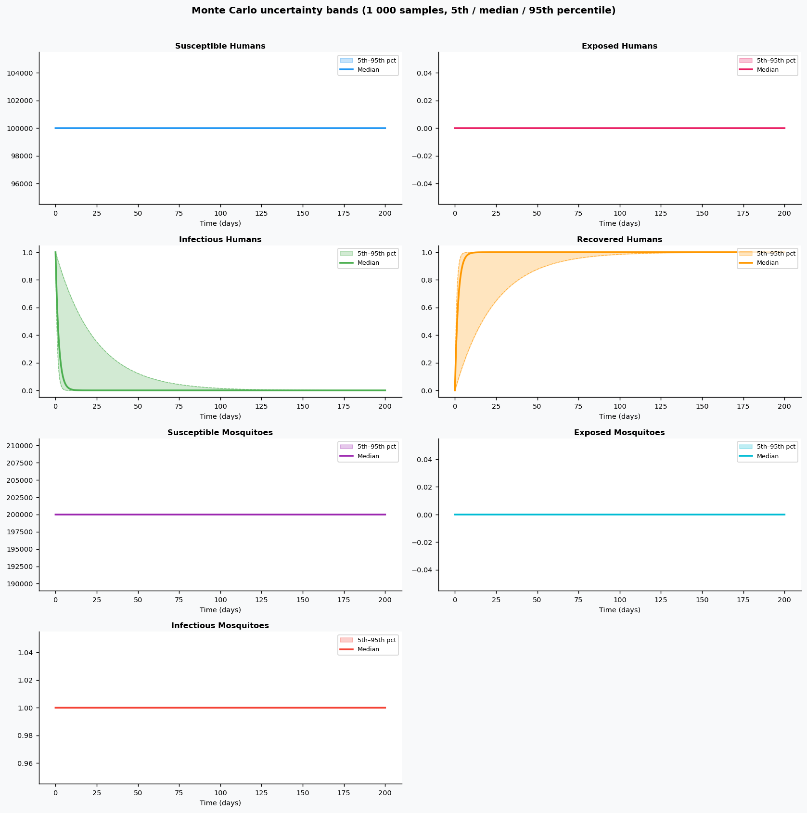

# Phase 4 — Uncertainty quantification: Zika3

This report summarizes parameter distributions (general framework), Monte Carlo simulation, and sensitivity analysis.

## Source model provenance

| Field | Value |
|-------|-------|
| Phase 3 fill mode | retrieval_only |
| Phase 3 run dir | `zika3_gemini_phase3` |

---

## 1. Parameter distributions (Task 9.1)

Distributions are assigned using the **general framework** (typed parameter uncertainty): same distribution families and typical ranges for similar parameter types across diseases.

| Parameter | Type | Family | Low | High | Point | Note |
|-----------|------|--------|-----|------|-------|------|
| β_H | transmission | lognormal | 0.05 | 1 | 0.525 | † |
| β_V | transmission | lognormal | 0.05 | 1 | 0.525 | † |
| 1/α_H | recovery | lognormal | 3.533 | 9.274 | 5.9 |  |
| 1/α_V | recovery | lognormal | 6.287 | 16.5 | 10.5 |  |
| 1/γ | recovery | lognormal | 2.994 | 7.859 | 5 |  |
| 1/δ | recovery | lognormal | 4.67 | 12.26 | 7.8 |  |
| r | other | uniform | 0 | 1 | 0.5 | † |
| ϕ | other | uniform | 0 | 1 | 0.5 | † |
| N | other | uniform | 0 | 1 | 0.5 | † |
| R_0 | transmission | lognormal | 1.401 | 4.427 | 2.6 |  |

† Range inferred from parameter type — no value recovered from paper text.

## 2. Monte Carlo simulation (Task 9.2)

- **Samples:** 1000   **Days:** 200   **Compartments:** Susceptible Humans, Exposed Humans, Infectious Humans, Recovered Humans, Susceptible Mosquitoes, Exposed Mosquitoes, Infectious Mosquitoes

**Peak value spread (5th / 50th / 95th percentile across ensemble):**

| Compartment | P5 peak | P50 peak | P95 peak |
|-------------|---------|----------|----------|
| Susceptible Humans | 99999.00 | 99999.00 | 99999.00 |
| Exposed Humans | 0.00 | 0.00 | 0.00 |
| Infectious Humans | 1.00 | 1.00 | 1.00 |
| Recovered Humans | 1.00 | 1.00 | 1.00 |
| Susceptible Mosquitoes | 199999.00 | 199999.00 | 199999.00 |
| Exposed Mosquitoes | 0.00 | 0.00 | 0.00 |
| Infectious Mosquitoes | 1.00 | 1.00 | 1.00 |

## 3. Sensitivity analysis (Task 9.3)

**Parameter ranking by combined impact on peak infections + total cases:**

| Rank | Parameter | Peak impact | Total cases impact | Combined |
|------|-----------|------------|-------------------|---------|
| 1 | β_H | 0.0000 | 0.0000 | 0.0000 |
| 2 | β_V | 0.0000 | 0.0000 | 0.0000 |
| 3 | 1/α_H | 0.0000 | 0.0000 | 0.0000 |
| 4 | 1/α_V | 0.0000 | 0.0000 | 0.0000 |
| 5 | 1/γ | 0.0000 | 0.0000 | 0.0000 |
| 6 | 1/δ | 0.0000 | 0.0000 | 0.0000 |
| 7 | r | 0.0000 | 0.0000 | 0.0000 |
| 8 | ϕ | 0.0000 | 0.0000 | 0.0000 |
| 9 | N | 0.0000 | 0.0000 | 0.0000 |
| 10 | R_0 | 0.0000 | 0.0000 | 0.0000 |

---
*Generated by Phase 4 (uncertainty quantification). Model: `zika3`. General framework: `phase 4/data/general_framework.json`.*